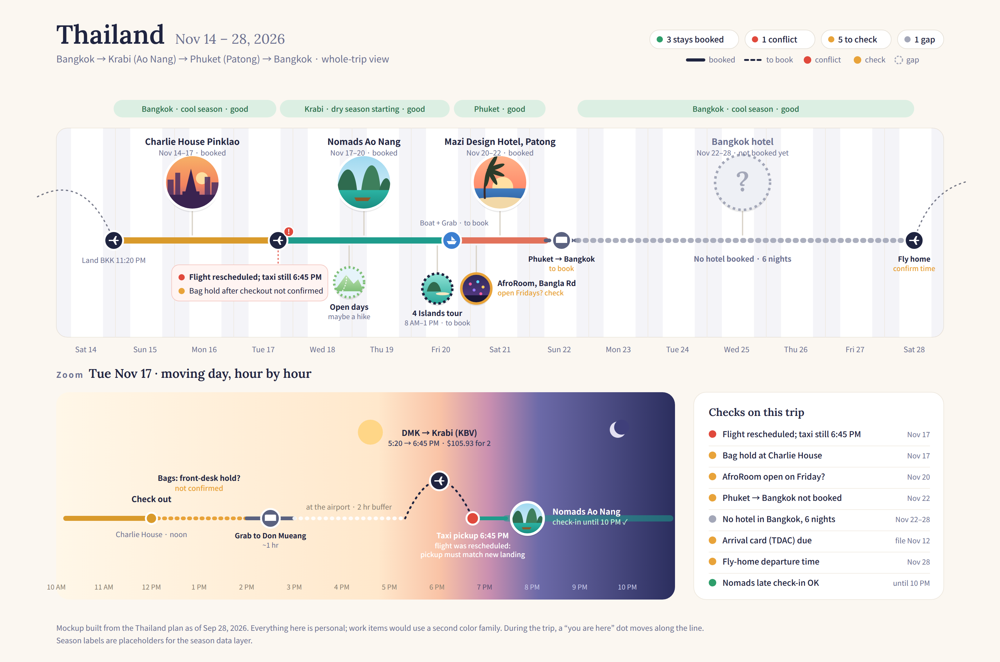

# Destination Helper — the brief, every version on one page

The product brief and capability list for the Destination Helper, kept as
one page. **The current version is v7 (Sep 28, 2026)**, and it is the spec
the app is built from: `scripts/extract_helper_doc.py` reads the v7 docx
into `packs/helper.sqlite`, and the Trips app shows it on its Helper tab.
The earlier versions follow in full, oldest last, so nothing written along
the way is lost. Each version folds the one before it in (see the change
log at the end of v7), so read v7 and dip into the others for history.

The Word originals sit beside this file: `destination-helper-v7.docx`,
`destination-helper-v3.docx`, `destination-helper-universal.docx` (v2),
`destination-helper-capabilities.docx` (v1).

| Version | Date | What it added |
|---|---|---|
| v7 | Sep 28, 2026 | the timeline mockup and "Building it: the phone app" (how it runs, screens, back end, connections, privacy, the Nov 13 target) |
| v6 | Sep 28, 2026 | the planning-stage layout (data, filters, plan) and the visual timeline concept |
| v5 | Sep 28, 2026 | the first five onboarding questions |
| v4 | Sep 28, 2026 | who it's for (organizers first), how we reach them (clubs and schools), the competitive advantage, knowing the place before you go, same-trip-cheaper-place, ideas to consider, naming, Wingman partner-or-compete; Part B grew |
| v3 | Sep 28, 2026 | one file for the app: Part A (product brief) and Part B (market scan); four questions and three workflows for running the trip; messaging in the region packs |
| v2 · universal | Sep 27, 2026 | made universal: codes, fill-ins, the region pack template, the Thailand pack, NEW tags |
| v1 · capabilities | Sep 27, 2026 | the capability list from the three Thailand planning chats |

---

# Version 7 (current) — Product Brief & Capability List

Destination Helper — Product Brief & Capability List (v7)

One file for the app. **Part A** is the product idea, decisions and open questions. **Part B** is what other companies do and where they fall short. **Parts 1–5** are the capability list: questions, methods, workflows, guardrails and region packs. Updated Sep 28, 2026.

## Part A — Product brief

### What it is

A trip co-pilot: it plans the trip, then helps you run it. It covers work and leisure, and trips of any size, from two weeks abroad to a Saturday outing.

What keeps it from being "Wanderlog part 2"

It's only different if the center is what Wanderlog doesn't do:

1.  **It checks the plan.** It catches mistakes before they cost money: a taxi booked before you land, a price that's per person rather than total, the last ferry leaving before you arrive, the real door-to-door cost.

2.  **It handles work travel and mixed trips.** Every item is tagged work or personal, costs split into "company pays" and "I pay", and a work trip can be stretched into vacation days.

3.  **It runs the trip.** Live notices, confirmations and checklists, not just a stored plan.

Test: would a happy Wanderlog user switch for it? If only the basics are there, no.

### How it works: three stages

- **Plan:** routes, timing, costs, and the checks.

- **Prepare:** confirm bookings, run the before-you-go checklist, flag deadlines.

- **Run:** live notices tied to your plan. "Traffic's heavy, leave 20 minutes early." "Your ferry was cancelled; here's the next one."

Decisions so far (Sep 28, 2026)

- **Confirmations:** a message first (a text, or LINE or WhatsApp where businesses use those), then an AI call only if there's no reply. The call says up front that it's an AI.

- **First test:** the Thailand trip (Nov 13–28, 2026).

- **After that:** micro trips for activities, meaning short outings that happen weekly.

- **Scope:** all types of travel and activities, big or small. Start narrow, then widen.

- **Who it's for first:** trip organizers, the person who plans for the group. Small-business owners and freelancers become the paid tier later; everyday vacationers arrive as the friends organizers invite.

- **How we reach them:** through clubs and organizations, starting with schools.

- **Build or partner:** build our own. Wingman City Guide is a possible partner later, once the app works and has users.

### Open questions

- **When do business travelers come in?** Organizers come first. Small-business owners and freelancers who handle their own receipts are the later paid tier. Companies booking for staff (Navan and SAP Concur territory) stay out of scope.

- **What's the name?** "Copilot" belongs to Microsoft, and Wingman, Legwork and Right Seat are taken or crowded. First Officer looked clean in a quick check. Run a real trademark search before committing.

- **How does it make money?** Leisure planners earn little per user (Wanderlog Pro is \$39.99 a year). Company tools earn a lot per company. An app for individuals who travel for both sits in between.

- **Which kind of trip should it be great at first?**

- **Will people pay to replace what they use now** (Wanderlog + TripIt + a receipts app)?

Gap, or a headache nobody wants?

- **Checking the plan: mostly a real gap.** The headache is messy data (ferries, vans and small hotels don't come in clean feeds) and false alarms. It's still solvable: the traveler forwards their own confirmations, and most checks are simple rules. Travel Sane shows a small version works.

- **Work/personal split: the headache is mostly the company's.** Insurance, taxes, company policy and duty of care make it hard for employers. An app for the individual can skip most of that: tag, split costs, export receipts.

- **Money: the real headache.** This is the most likely reason the space is empty, and the biggest thing to test.

Why the big apps don't do it yet (our read)

1.  **They each serve one customer.** Wanderlog and Google earn from leisure travelers; Navan and SAP Concur sell to employers.

2.  **Mixing work and personal is messy:** who pays for extra nights, insurance that stops when the work part ends, taxes, and keeping personal bookings private from employers.

3.  **Checking needs data that's hard to get.** Flights come in standard data feeds; taxis, ferries, vans and hostels come as scattered emails and local sites. Local knowledge (last ferry, which pier) is hard to scale, and wrong alerts kill trust.

4.  **Planners focus on the fun part,** the dreaming and mapping before you book. Most mistakes show up after booking, in the logistics.

Risks

- **Too wide to start.** Being okay at every kind of trip loses to apps that are great at one.

- **Google is heading here.** At I/O 2026 it announced calling businesses for you (starting with home repair, beauty and pet care), booking local experiences, and agents that watch the web around the clock, all rolling out in the US this summer. Maps already does live traffic. Don't compete on the pieces Google gives away; compete on tying them to the whole plan.

- **Running the trip means owning the mistakes.** One wrong "leave now" and someone misses a flight. Alerts have to be right almost every time.

- **Calling is the hardest piece.** Rules on AI calls vary, some places require saying it's an AI, and abroad there are language barriers. Many small businesses prefer messaging anyway.

- **It needs a lot of trust:** access to location, email and calendar.

- **One user isn't proof.** Building it for your own trips is great for building, but it doesn't show other people want it.

### Where it wins

One brain that knows the whole plan and ties live updates to it. Example from the Thailand planning: it caught an airport taxi booked for 12:00 PM against a 6:45 PM landing.

First questions (onboarding)

Five questions at the start narrow the scope and make the app easy to use. If only three fit, use 1–3. Everything else (passport country, bags, room preferences) is asked later, only when a step needs it.

1.  **"Who's going, and is it work, personal, or both?"** Sets group size, so every price shows per person and for the group, and turns work tagging on or off. (The Thailand planning assumed a couple and never settled the headcount.)

2.  **"Where and when, or not sure yet?"** Sets dates and trip size, from two weeks abroad to a Saturday outing. "Not sure yet" opens the same-trip-cheaper-place comparison and the season check; a known place and dates goes straight to planning, with a warning if it's a bad season.

3.  **"What's your budget, and what matters most?"** Sets a price cap and the trip's style (beaches, nightlife, hikes, gyms, meetings). Stops the app suggesting a \$317 flight to someone who won't pay it, and tells it what "similar" means when comparing places.

4.  **"What's already booked?"** (forward the confirmations or connect email) The checks start right away. On day one the app can say "your taxi is booked before you land," so the user sees the value before doing any planning. This is the most important of the five.

5.  **"How much should I handle?"** (plan it for me / check my plan / just remind me, plus whether it can message or call businesses for you) Organizers like control, so this answers it up front, and it's where the user gives permission for the text-then-call confirmations.

### Planning-stage layout: data, filters, plan

The planning screen has the data on one side and the questions and filters on the other. The filters narrow the data, your picks go into the plan, and the checks run on the plan. The Prepare and Run stages work from that same plan (Prepare: W25, W27; Run: W28, W29).

**Left side: the data (what the app knows)**

| **Bucket** | **What each item holds** |
|----|----|
| Places | area type (beach, city, nature), season by month (weather, crowds, price level), safety notes |
| Stays | area, price per night, rating, check-in hours, holds bags, work-friendly (Wi-Fi, desk), distance to key spots |
| Activities | type tags (snorkel, nightlife, hike, gym, tour), length, price per person, fees, open days and hours, best season |
| Routes | from, to, mode (flight, bus, ferry, taxi), where it really leaves and ends, times, last departure, price, bags |
| Price history | every price saved with the date it was checked; feeds comparisons now and predictions later |
| Businesses | how to reach them (text, WhatsApp, LINE, call) and how reliably they answer |

**Right side: questions and filters (what narrows it down)**

- **The five first questions set the defaults:** group size (per person vs group price), work vs personal, place and dates (or "not sure," which opens the comparison), budget cap and style tags, what's already booked (fixed times and places), and how much the app should handle.

- **Live filters on the map and list:** type and tags, price range (per person or group), travel time from your base, open during your free time, season fit for your dates (good, okay, bad), rating and reliability, work-friendly, booked vs not booked.

**Middle: the plan (what comes out)**

- Trip → days → items (stay, activity, ride).

- Each item carries: time, cost, work or personal, must-attend or optional, status (idea, booked, confirmed), and check flags (conflict, gap, tight timing).

Visual timeline (concept)

The timeline should feel like a journey, not a grid of boxes and letters:

- **One flowing route line** through the whole trip, with stops as photo bubbles of the place. The line's style shows the mode: an arc for flights, a wave for ferries, a road for vans and taxis.

- **Distance on the line is real time,** so travel and buffers are visible as space between stops. A tight connection looks tight.

- **Day and night shading** behind the line (sunrise to sunset), so late arrivals and early starts stand out.

- **A weather and season strip** above each day, colored by how good that season is for the place.

- **Color by meaning:** work items in one color family, personal in another; must-attend solid, optional softer.

- **Checks as markers on the line:** red for a conflict, amber for tight timing, a gray gap for "no hotel tonight."

- **Zoom:** the whole trip as chapters (one per place) down to a single day, hour by hour.

- **Linked to the map:** tap a stop on the timeline and the map shows it, and the reverse.

- **During the trip:** a "you are here" dot moves along the line, and a delay visibly pushes everything after it.

- **After the trip:** the same line becomes the shareable recap, with photos, highlights and total spend.

**Mockup (Thailand trip):** the whole-trip view on top, Nov 17 zoomed hour by hour below, and the checks panel on the right.

*Built from the Thailand plan as of Sep 28, 2026. Season labels are placeholders for the season data layer.*

### Building it: the phone app

1.  **How it runs on phones.** Start with a web app that works on phones: one build for iPhone and Android, installable to the home screen, no app store approval. Move to a store app (React Native or Flutter) once it works. Apple's developer account is \$99 a year; Google Play is \$25 once.

2.  **Phone screens first:** trip setup (the five questions), a vertical timeline (top to bottom, pinch from whole trip to one day), a map toggle or split view, the checks list, and a travel-day screen with only what's next.

3.  **Behind the scenes:** accounts and a database for trips, days and items (the data, filters, plan layout above), plus sharing so the group sees one trip. Services like Supabase or Firebase cover this.

4.  **Connections, easiest first:**

    - **Easy:** maps (Google Maps or Mapbox); weather and season history.

    - **Medium:** bookings by forwarding confirmation emails to the app's own address (reading Gmail directly needs Google's security review); push notifications (web apps get them once added to the home screen).

    - **Hard:** live flight status (paid data), texting businesses (Twilio, WhatsApp Business), and AI phone calls last.

5.  **Privacy and security:** it stores people's bookings and travel dates, so it needs a privacy policy, a secure setup, and only the permissions it truly uses.

**What Claude speeds up, and what it can't:** code, screens, the checks logic and the data layout move fast. Other companies' approvals (Google, Apple, WhatsApp), paid data, real users' feedback, getting alerts right every time, and your own hours don't.

**Realistic target for Nov 13:** a phone web app with trip setup, the vertical timeline, forwarded-email import and the checks, tested on the Thailand trip. Live alerts, texting and calls come after.

### Who it's for

- **First: trip organizers,** the person who plans for the group, for big trips and micro trips.

  - They feel the pain most: logistics, confirmations, timing, splitting costs.

  - Each one brings a group of 3–8 people into the app for free.

  - They care about getting it right, so the checks and live help matter to them.

  - The catch: organizers like control and many already use Wanderlog or spreadsheets. The app has to back them up (check, remind, confirm), not take over.

- **Later, the paid tier: small-business owners and freelancers** who travel for work, mix in leisure, and need receipts sorted.

- **Everyone else:** vacationers arrive as the friends organizers invite.

- **Pitch to organizers:** "You plan it. We make sure nothing breaks."

### How we reach them

- **Clubs and organizations, starting with schools.** Club officers already organize trips, retreats and outings, so they're organizers by nature, and each club is a ready-made group.

- **Every shared trip is an invite.** Friends who join a trip see the app working.

- **Launch on Product Hunt** once there's something working to show.

- **Watch out:** students have small budgets. Clubs are great for spreading the app, not for revenue, which is why the paid tier for business owners matters.

### Our competitive advantage

**In one line:** it knows when your plan is wrong and helps you fix it, for work and personal trips, big or small.

1.  **It checks the plan:** the taxi booked before you land, the per-person price, the last ferry, the night with no hotel.

2.  **It runs the trip:** confirmations (message first, call if no reply) and live notices like "leave 20 minutes early."

3.  **Work and personal in one trip:** tag items, split costs, stretch a work trip into vacation days.

4.  **Local activities, small and large:** micro trips, not just big vacations. This is the gap spotted in Wingman.

Each piece exists somewhere; nobody combines them for the individual traveler.

**The map and timeline only become an advantage if they show what the checks find:**

- **Map filters others don't have:** booked vs not, work vs personal, open right now, fits your free time, reachable before the last ferry or train.

- **A timeline that reasons:** conflicts in red, travel time and buffers between items, gaps flagged, items colored must-attend vs optional, and everything shifting when a flight is delayed.

**Social import (TikTok, Reels):** Wanderlog and Google Maps don't do it, but Wingman, Plotline, DocentPro, Rhyme and Wandereel already do. Add it, but don't pitch it. It becomes ours when a saved Reel turns into something that fits the plan: open when you're free, reachable in time, priced for the group, flagged if closed that day.

This is still a theory until other people use it. The Thailand trip is where the checks and live notices get proven.

### Know the place before you go

Most planners let you build a trip without telling you what the place will be like when you get there, so you can book right into a bad season without knowing it. The app should show, and flag inside the plan:

- **Weather history** for your exact dates: rain, heat, daylight.

- **Season:** high, low, and monsoon; what closes in the off-season.

- **Crowds, holidays and events.**

- **Prices by month:** when the same trip costs less.

- **Flags in the plan itself,** like "You're booking the Gulf islands in November, their heaviest rain," which is exactly what came up in the Thailand planning.

**Who does parts of this:** Weather Spark (weather history by month), TripSeason (a season-by-month app, 100 destinations), Best Times to Visit (weather, crowds, prices and events for 300+ places), and Google Flights (price history for flights). All of them are reference tools you check separately; none of them looks at your actual plan.

**Honest pushback:** weather and price history are easy to get. Crowds, and whether a given business is open in low season, are hard. That knowledge belongs in region packs and builds up trip by trip.

### Same trip, cheaper place

Compare what the same kind of trip really costs in different places. Beaches, snorkeling and nightlife in Phuket vs. Cancún vs. Bali: flights, stay, activities, local transport and fees, per person and door to door.

- **What exists:** Google Flights Explore, Skyscanner's "Everywhere" search and Kayak compare flight prices across places, and Kayak and Hopper predict prices. One 2026 comparison found that no engine compared full trip costs.

- **Why it fits:** it's the checks applied to comparison. Price comparisons usually mislead on per-person vs total, taxis, park fees and bag charges. It's also one of the few features people might pay for.

- **Pushback on "predictive":** prediction needs years of price history. Start by comparing today's real prices, then add "prices here usually rise in high season" once there's enough data.

- **"Similar" has to be defined:** every place and activity needs tags by type (snorkeling, nightlife, hikes, gyms, work-friendly). That tagging is work, and it's also what makes the feature hard to copy.

Ideas to consider (pick two or three)

- **A Michelin-style award for reliability, not taste.** Nobody rates whether a place actually works for travelers: answers messages fast, honors bookings, starts on time, charges what it listed. The confirmation feature collects exactly that, and a "Reliable" badge gives businesses a reason to answer faster, which improves the data. It only means something with volume, so it's a later-stage idea. Never let anyone pay for it, and keep it positive (awards, not public bad scores).

- **Trip health score:** one number for how solid a plan is.

- **Copy a real trip:** share a trip, checks included, so friends can reuse it.

- **Group mode:** roles, votes and cost splitting.

- **Local operators listed and bookable:** small tours and activities, which also earns a commission.

- **Receipt capture for work trips.**

- **Travel-day screen:** only the next move, when to leave, and the confirmation code.

- **Trip recap:** map, highlights and spend after the trip, worth sharing.

Wingman City Guide: partner or compete?

**Decision: build our own, and consider partnering later.**

- **We'd have nothing to trade yet.** They're an established team with an app live since Oct 2024 and 100K+ downloads.

- **Pitching our plan now could hand them the idea.**

- **We want different things:** they do free city exploring and audio walking tours in Europe; we make the trip work.

- **Partnering later could make sense,** once our app has users: their audio tours inside our plans, our trip-running for their users.

- **Their gap is real but thinly backed:** their own team's Product Hunt review asks for more cities and more local content, but outside user reviews are too few to confirm it.

First test: the Thailand trip (cases already waiting)

- **Check:** the rescheduled Krabi flight against the 6:45 PM airport taxi.

- **Confirm:** bag holds at Nomads and Charlie House (message first, call if no reply).

- **Plan and book:** Phuket → Bangkok, and the Bangkok hotel.

- **Checklist:** the online arrival card (file Nov 12), and a driving permit if you'll ride scooters.

- **Run live:** Bangkok traffic on the way to Don Mueang (Nov 17) and the afternoon boat to Phuket (Nov 20).

### Next step to validate

Talk to 5–10 people who travel for both work and leisure. Would they pay to replace Wanderlog + TripIt + a receipts app? Start with the guys on the Thailand trip.

## Part B — Market scan (as of Sep 28, 2026)

A quick scan, not a full market study. Every entry links to where the information came from.

### Who does what

| **Company** | **Plans the trip** | **Checks the plan** | **Runs the trip live** | **Work/personal split** | **Contacts businesses for you** |
|----|----|----|----|----|----|
| Wanderlog | Yes | No | No | No | No |
| Google (Travel, Maps, Search) | Yes (AI Mode, Canvas) | No | Partly (live traffic in Maps) | No | Starting (some US categories, 2026) |
| TripIt | Organizes bookings | Flights only | Flights only (Pro) | No | No |
| Travel Sane | Organizes bookings | Yes (gaps, tight connections, overlaps) | Flight alerts "coming soon" | No | No |
| Navan | Company booking | Company policy | Yes (rebooking, disruption support) | Yes, for companies | No |
| Vacation Planner | Yes | Not checked | Not checked | Yes (light) | No |
| Wingman City Guide | Yes (AI city plans) | Not checked | Partly (audio tours on the walk) | No | No |
| AI planners (Mindtrip, Gemini, Trip.com, Booking.com, GuideGeek) | Yes | Not checked | No (planning only) | No | No |

Nobody found combines all of it for the individual traveler.

Wanderlog

- **Focus:** map-first planning before you book, together with friends. Aimed at leisure travelers who build the plan themselves, especially road trips and group trips.

- **Free:** plan and map side by side with unlimited places and driving times; live group editing across devices; bookings added by forwarding confirmation emails; suggested restaurants and things to do (Tripadvisor data); budget tracking entered by hand; checklists and AI packing lists; user travel guides; hotel search and booking; directions sent to Google Maps.

- **Pro (\$39.99 a year):** offline maps and plans, AI assistant, route optimization, automatic Gmail scanning, unlimited attachments, Google Maps export, flight and rental deals, dark mode.

- **Shortcomings:** nothing for business travel; no flight alerts, gate changes or seat tracking; the AI suggests places but doesn't write the whole plan (a 10-day trip takes 2–5 hours by hand); no budget-aware planning, currency conversion or weather-aware scheduling; nothing checks the plan for mistakes; slowdowns reported on very large trips.

- **Sources:** [<u>Wanderlog</u>](https://wanderlog.com/), [<u>Monkey Eating Mango: pricing 2026</u>](https://monkeyeatingmango.com/blog/wanderlog-pricing-2026/), [<u>Monkey Eating Mango: Wanderlog vs TripIt 2026</u>](https://monkeyeatingmango.com/blog/wanderlog-vs-tripit-2026/)

Google (Travel, Flights, Maps, Search, Gemini)

- **History:** the Google Trips app shut down in August 2019; its pieces were split across Travel, Maps, Flights and Search.

- **Now:**

  - Google Travel: bookings pulled from Gmail and grouped by trip, plus flight and hotel search. Android Police reports trip summaries are being phased out (date not confirmed).

  - Google Flights: price tracking and deal alerts.

  - Google Maps: saved place lists, a Timeline of where you've been, and Gemini that finds places from a screenshot.

  - AI Mode in Search with Canvas: one editable plan pulling in flights, hotels, attractions, Maps info and reviews.

  - AI Overviews: day-by-day trip guides.

  - Gemini Gems: custom travel assistants.

- **I/O 2026 (rolling out in the US this summer):** booking for local experiences and services; Google calling businesses for you in some categories (home repair, beauty, pet care); information agents that watch the web around the clock.

- **Focus:** search and booking, plus AI trip ideas. Not a planner you keep and manage through the trip.

- **Shortcomings:** no live group editing, no budget tracking, and reviews say it lost the offline access and day-by-day planning the old Trips app had. Nothing for business travel.

- **Sources:** [<u>Google: Search I/O 2026 updates</u>](https://blog.google/products-and-platforms/products/search/search-io-2026/), [<u>Tripstone: Google Trips is dead</u>](https://tripstone.app/blog/google-trips-alternatives), [<u>Android Police: trip summaries</u>](https://www.androidpolice.com/google-killing-this-scheduling-tool/), [<u>Shattered: Google AI travel tools 2026</u>](https://shattered.io/google-ai-travel-tools-planning-2026/), [<u>AlternativeTo: Google Trips shutting down (2019)</u>](https://alternativeto.net/news/2019/6/google-s-travel-planning-app-trips-is-shutting-down-on-august-5th-2019), [<u>Skift: Google's AI trip planner</u>](https://skift.com/2025/03/18/what-happened-to-googles-ai-trip-planner/)

TripIt

- **Focus:** organizing booked trips, mostly for frequent business travelers.

- **Free and Pro:** itineraries from forwarded emails, calendar sync, airport maps, neighborhood safety scores, nearby attractions, carbon footprint.

- **Pro (\$49 a year):** real-time flight alerts, alerts for trip disruptions, alternate flights, fare-refund monitoring, check-in reminders, "Go Now" to the airport, gate and terminal reminders, seat help, airport navigation, reward program tracking, passport renewal reminders, more document storage.

- **Shortcomings:** the checks are about flights only; nothing on ground transport, hotels or prices; not a map-based planner.

- **Source:** [<u>TripIt Pro pricing and features</u>](https://www.tripit.com/web/pro/pricing)

### Travel Sane

- **Focus:** turning scattered confirmation emails into one timeline, for independent travelers who book across many sites.

- **Checks:** nights with no hotel booked, connections under 90 minutes, arriving at one airport but leaving from another, overlapping bookings.

- **Pricing:** free tier (3 bookings per trip); Pro \$75 one-time (unlimited bookings, PDF, share links, email forwarding; flight alerts "coming soon").

- **Shortcomings:** only looks at bookings; no planning, live help, or price checks (per person vs total, last departures).

- **Source:** [<u>Travel Sane</u>](https://travel-sane.com/)

Navan

- **Focus:** company travel and expenses, sold to employers.

- **Work/personal:** separates business and personal expenses automatically, keeps personal bookings private from the employer, blocks company charges on personal days, collects loyalty points.

- **Runs the trip:** policy-aware booking and rebooking, itinerary changes, traveler support.

- **Shortcomings for this app's user:** you only get it if your employer uses it; not built for freelancers or leisure trips on their own.

- **Its numbers (vendor source, so treat with care):** 76% of business travelers have added leisure to a work trip at least once; 68% extend at least one trip a year (2.3 nights on average).

- **Sources:** [<u>Navan: bleisure statistics</u>](https://navan.com/blog/bleisure-travel-statistics), [<u>Thunderbit: AI travel agents 2026</u>](https://thunderbit.com/blog/ai-travel-agent)

### Vacation Planner

- **Focus:** leisure planning, with a light work/personal split.

- **Work/personal:** tags expenses as company card or personal card; separate work-day and leisure-day blocks in the plan.

- **Shortcomings:** says itself it's "not a business travel tool" (no corporate booking or expense software link).

- **Source:** [<u>Vacation Planner: bleisure planning</u>](https://blog.vacation-planner.app/blog/bleisure-travel-planning/)

### AI trip planners

- **Who:** Google Gemini (fast plans and research), Booking.com AI Trip Planner (hotel-centered), Trip.com Trip.Planner (multi-leg plans with flights, hotels, attractions), Mindtrip (visual, map-aware planning), GuideGeek (travel questions in messaging apps), Hopper (price prediction), Expedia's Romie (chat-based discovery inside Expedia).

- **Shortcoming:** most stop at planning; handling changes during the trip is mainly done by company tools like Navan.

- **Source:** [<u>Thunderbit: AI travel agents 2026</u>](https://thunderbit.com/blog/ai-travel-agent)

### Wingman City Guide

- **Focus:** free city exploring: AI plans plus self-guided audio walking tours.

- **Does:** AI city plans in under a minute; 650+ audio tours across 155+ European cities; turns saved TikToks and Reels into trips; planning with friends; city guides (food, transport, safety, budget). Free, iOS and Android.

- **Who:** Safisoft kft. in Budapest. On the App Store since Oct 13, 2024; Google Play 100K+ downloads, 3.8 stars (144 ratings).

- **Shortcomings:** Europe-focused and walking-tour-centered; thin on local tours and on small and large activities. Its only Product Hunt review, from a team member, asks for more cities, more local content and better place detection from videos. Nothing for checking plans, running the trip or work travel.

- **Name conflict:** it's a trip planner called Wingman, so that name is out for us.

- **Sources:** [<u>wman.com</u>](https://wman.com/), [<u>App Store</u>](https://apps.apple.com/us/app/wingman-city-guide/id6736835761), [<u>Google Play</u>](https://play.google.com/store/apps/details?id=com.wingman.cityguide&hl=en), [<u>Product Hunt</u>](https://www.producthunt.com/products/wingman-city-guide), [<u>Product Hunt reviews</u>](https://www.producthunt.com/products/wingman-city-guide/reviews), [<u>Wingman itinerary creator</u>](https://blog.wman.com/itinerary-creator/)

Other tools we found (Sep 28, 2026)

| **Tool** | **What it does** | **What it misses** | **Source** |
|----|----|----|----|
| Plotline | Share a TikTok or Reel; pins every place on a map; builds a day plan (iPhone only) | No checks, live help or work travel mentioned | [<u>Plotline blog</u>](https://getplotline.app/blog/best-travel-planning-apps-social-media) |
| DocentPro | Pulls places from Instagram, TikTok and YouTube into an AI plan | No checks, live help or work travel mentioned | [<u>DocentPro blog</u>](https://docentpro.com/blog/best-apps-to-save-places-from-tiktok-instagram-youtube) |
| Wandereel | Share a travel Reel or TikTok; plans and budgets the trip | No checks, live help or work travel mentioned | [<u>Wandereel</u>](https://www.wandereelapp.com/) |
| Weather Spark | Weather history by month, day and hour for trip planning | Not a planner; doesn't look at your plan | [<u>Weather Spark</u>](https://weatherspark.com/) |
| TripSeason | Season charts (temperature, rain, daylight) and a tourism score for 100 destinations | Not a planner; weather only | [<u>App Store</u>](https://apps.apple.com/us/app/tripseason-best-time-to-visit/id6740165920) |
| Best Times to Visit | Best months for 300+ places: weather, crowds, prices, events | Reference site; earns from hotel links | [<u>besttimestovisit.com</u>](https://besttimestovisit.com/) |
| Google Flights Explore | Cheapest flights to many places over the next six months; price history and alerts | Flights only; no full trip cost | [<u>Going: how to use Google Flights</u>](https://www.going.com/guides/how-to-use-google-flights) |
| Skyscanner "Everywhere" / Kayak | Cheapest places to fly; Kayak adds a buy-or-wait price forecast | Flights only; no engine compared full trip cost | [<u>Truescho: flight search compared 2026</u>](https://truescho.com/en/blog/skyscanner-vs-google-flights-vs-kayak-vs-kiwi-2026) |

Plotline and DocentPro's blogs rank their own apps, so treat their rankings with care. Both agree that Wanderlog and Google Maps can't import from social media.

### Names already in use

- **Copilot:** Microsoft (Copilot, GitHub Copilot). A travel app called Copilot2trip also exists: [<u>Product Hunt</u>](https://www.producthunt.com/products/copilot2trip).

- **Wingman:** Wingman City Guide (above).

- **Legwork:** a travel app for discovering, planning and sharing trips: [<u>legwork-app.com</u>](https://www.legwork-app.com/).

- **Right Seat:** RightSeat AI, an AI strategy firm: [<u>rightseat.ai</u>](https://www.rightseat.ai/).

### Where to scout and launch: Product Hunt

A site where new apps and tech products launch and get upvoted and commented on daily; startups use it for early users and feedback. Its travel planning category is a quick way to see new competitors: [<u>Product Hunt travel planning</u>](https://www.producthunt.com/categories/travel-planning).

### Why mixing work and leisure is hard for companies

- Duty of care gets blurry once the work part ends.

- Companies lose track of where travelers are during personal days.

- Insurance can stop covering the leisure days.

- Working abroad can bring tax and visa problems.

- Someone has to decide who pays for extra nights, upgrades and meals.

- **Source:** [<u>Business Travel Executive: when business and leisure mix</u>](https://www.businesstravelexecutive.com/special-report/balancing-act-when-business-and-leisure-mix/)

## How the capability list works

Parts 1–4 work for any destination. Anything that only applies to one place lives in a **region pack** (Part 5). The Thailand trip is the first pack.

**How it's built**

- **Codes:** every question, workflow and guardrail has a code (GET-01, W01, G01). New items take the next free number in their section. Never reuse a code.

- **Fill-ins:** \[A\] = where you start, \[B\] = where you're going, \[C\] = a third option, \[X\] and \[Y\] = a place or stop, \[base\] = where you're staying. \[activity\], \[venue\], \[price\] and \[day and time\] mean what they say.

- **NEW:** added so the helper works anywhere, but not tried on a real trip yet. Drop the tag once it's been used.

- **Track record:** how a workflow did on each trip:

  - **Proven:** it worked, and you booked or decided with it

  - **Adopted:** you went with it, but nothing is booked yet

  - **Open:** it hit a wall or isn't finished

  - **Rejected:** you turned down what it came back with

**How to add more**

- **A question:** put it in the right section with the next code, write it with fill-ins, and put the place-specific example in that trip's region pack.

- **A method or check:** if it works anywhere, add it to Part 2. If it only works in one country, add it to that region pack.

- **A workflow:** use the same fields: Runs when, Steps, Track record (add Gives when the result isn't obvious).

- **A guardrail:** write the rule, then "Why" with the trip it came from.

- **A new place:** copy the region pack template in Part 5.

- **After every trip:** run W26 (Wrap up a trip).

## Part 1 — Questions

### GO — Where to go

- **GO-01** What's a good second destination besides \[X\]?

- **GO-02** Is there somewhere closer, or on the way back?

- **GO-03** What's there? Is it really a good spot?

- **GO-04** What is this area like, and what is it for?

- **GO-05** Where's the better place to spend our time: \[A\], \[B\] or \[C\]?

- **GO-06** What's the weather like during our dates? Is it a good season to go? **NEW**

### READY — Before you go

- **READY-01** Do we need a visa or an arrival form? How long must our passports still be valid? **NEW**

- **READY-02** Are there any vaccines or health rules? **NEW**

- **READY-03** Do we need travel insurance, and does it cover what we'll actually do (scooters, water sports)? **NEW**

- **READY-04** Phone and data: local SIM, eSIM or roaming? **NEW**

- **READY-05** What plug type and voltage do they use? **NEW**

- **READY-06** Are there safety warnings or local laws we should know about? **NEW**

- **READY-07** What's the emergency number, and where's our embassy? **NEW**

- **READY-08** What should we pack for the weather and the activities? **NEW**

### GET — Getting from place to place

- **GET-01** How far is \[A\] from \[B\], and how long does each way of getting there take?

- **GET-02** Compare every way from \[A\] to \[B\] on price and speed.

- **GET-03** Are there ferries, trains or buses on this route? How much?

- **GET-04** How much is the next leg?

- **GET-05** Does this whole route work, start to finish?

- **GET-06** Can we see \[X\] on the way instead of making a separate round trip? Is that cheaper?

- **GET-07** Does it have to leave from \[X\], or can it leave from \[Y\]?

- **GET-08** Is there a cheaper way, including by water?

- **GET-09** Is there a third way, like going back to another airport and flying from there?

- **GET-10** Is there a route that skips the big hub city?

- **GET-11** Which option on this results page is best?

- **GET-12** Is the drop-off in the same spot as the next pickup?

- **GET-13** When we get off the bus, will the taxi meet us? Where does the driver meet us?

- **GET-14** How do we get from the pier, station or airport to the hotel?

- **GET-15** Will this arrival point put us in a good part of the city?

- **GET-16** Is there a private option, and what does it cost?

- **GET-17** Where is this cheaper to do from?

- **GET-18** What's the best way to get around day to day (ride-hail apps, taxis, transit passes)? **NEW**

- **GET-19** Can we rent a car and drive? What permit do we need, which side of the road, tolls, parking? **NEW**

### TIME — Timing

- **TIME-01** What's the timing on moving day: when do we leave, land and get to the hotel?

- **TIME-02** What time of day will we get there, and what's left of that day?

- **TIME-03** How much time do we actually get at a stop between fixed departures?

- **TIME-04** Does this activity fit before an afternoon transfer?

- **TIME-05** Any holidays, festivals or closures during our dates? **NEW**

- **TIME-06** When should we leave to get there on time? Tell us if traffic or delays change that. **NEW**

### STAY — Where to stay

- **STAY-01** Find a cheap, good place that's well placed for getting around and exploring.

- **STAY-02** Which place puts us in the best spot to catch the next ride?

- **STAY-03** What about this hotel? (name or link)

- **STAY-04** How far is it from the things to do?

- **STAY-05** What's the best area to stay in: beach, city, or something else?

- **STAY-06** Give me a price for each area.

- **STAY-07** Is it close to a specific place?

- **STAY-08** Does it store luggage? Are there storage places nearby?

- **STAY-09** Any reports of theft? Is it secure?

- **STAY-10** Where can we store luggage for the day, and which option is most reliable?

### DO — Things to do

- **DO-01** What is there to do here, on the water and on land?

- **DO-02** Tell me more about the land activities.

- **DO-03** What is there to do on \[X\], boat rides included?

- **DO-04** Is there \[activity\], \[activity\] and \[activity\] near here? (e.g. jet skiing, boating, snorkeling)

- **DO-05** Can one trip cover two activities?

- **DO-06** Is \[activity\] available in another city?

- **DO-07** What's the price for this one activity?

- **DO-08** Walking up and haggling: is that normal here, and how does it work?

- **DO-09** What if we skip \[X\] and do a day tour from \[base\] instead?

- **DO-10** Scooter rentals: where, how much, and what are the rules?

- **DO-11** Find a hike.

- **DO-12** Are there other nightlife spots with the same vibe?

- **DO-13** What should we eat, and where? **NEW**

- **DO-14** Any dress codes or customs for temples and other religious sites? **NEW**

- **DO-15** Plan a short outing: \[activity\] today or this weekend. **NEW**

### MONEY — Money

- **MONEY-01** Can we pay now, or at the property?

- **MONEY-02** Does this place have a history of overcharging?

- **MONEY-03** Translate the prices to my home currency (USD).

- **MONEY-04** How much is that for the whole group?

- **MONEY-05** Is this cheaper? What about this one? (screenshot of a booking page)

- **MONEY-06** You said about \[price\], so why is it \[price\]?

- **MONEY-07** Price it all the way through, with the timing.

- **MONEY-08** Verify the prices, each way.

- **MONEY-09** Log this expense. / Change the log and rerun the numbers.

- **MONEY-10** That's too much. Find something cheaper.

- **MONEY-11** Cash or card here? What do ATMs charge, and how much cash should we carry? **NEW**

- **MONEY-12** What's the tipping norm? **NEW**

- **MONEY-13** How much spending money should we bring per day? **NEW**

### BOOK — Booking help

- **BOOK-01** Give me the link(s).

- **BOOK-02** What am I clicking here? (site filters)

- **BOOK-03** What does this option do?

- **BOOK-04** Nothing's showing. Do I need another site?

- **BOOK-05** Which country do I pick in the nationality field? Does my home state matter?

- **BOOK-06** Lock in the services and times I found.

- **BOOK-07** Should we book now or wait? Is the price likely to go up? **NEW**

- **BOOK-08** What's the cancellation policy, and is flexibility worth paying for? **NEW**

- **BOOK-09** Confirm my reservation (message them; call if there's no reply). **NEW**

### ADMIN — Trip admin

- **ADMIN-01** Check my email and label everything trip-related.

- **ADMIN-02** Build a visual timeline of the trip, including what's still to do.

- **ADMIN-03** Add it to my calendar.

- **ADMIN-04** Remind me to follow up on \[day and time\].

- **ADMIN-05** Recap the plan, with flights and links.

- **ADMIN-06** Watch the trip while we're on it, and tell us when something changes. **NEW**

### TALK — Plain talk

- **TALK-01** Say it in simple terms. / What do you mean by that?

## Part 2 — Methods

Set up every new trip (ask once, save in the trip log)

- Who's going, and how many.

- Dates.

- Budget caps: per night, per leg, per day.

- What the trip is for (e.g. active days, nightlife, gyms/saunas/spas, water sports).

- Passport country and home currency. **NEW**

### Defaults for every answer

- Prices in local currency **and** your home currency (USD), at today's exchange rate.

- The per-person price **and** the total for the whole group, always saying which is which.

- A link for every price. If a price can't be checked, say so or leave it out.

- One clear pick, plus a runner-up.

- Plain words. Answer the exact question first.

- A "Sources" list at the end.

### Where the answers come from

- **Flight search (Expedia):** adults set to the group size, sorted by price, nonstop filter on. Search each airport in a city on its own. Check the next page of results before calling something the cheapest.

- **Airlines' own sites:** some budget airlines don't show up on the big search sites, and promo fares are often only on the airline's own site. List those airlines in the region pack.

- **Hotel search (Expedia, Booking.com):** the neighborhood as the destination (never the airport), exact nights and group size, a price cap per night, a minimum rating, a 3–5 km radius, property type, amenities (pool, ocean view), sorted cheapest, shown on a map.

- **The region's booking site for buses, vans, trains, ferries and taxis:** set the date and headcount on every search. Save the site's quirks in the region pack.

- **Rome2Rio:** quick map of every route between two places.

- **Ferry sites:** Direct Ferries plus the local pier or operator sites (schedules and the last departure of the day).

- **Tours:** GetYourGuide, Viator, Expedia Things to Do, Travelocity, and local operators' own sites.

- **Transfers:** Booking.com Taxi, Klook, GetYourGuide, Bookaway, local tour desks, and the region's ride-hail apps.

- **Luggage storage:** Bounce, Radical Storage, and local staffed counters (list them in the region pack).

- **Reviews:** Booking.com, Tripadvisor, Trip.com, Hotels.com, Hostelz, Wanderlog, Google, Viator.

- **Exchange rate:** TradingView or Yahoo Finance, looked up that day.

- **Parks:** the official park site for fees, hours and last entry.

- **Nightlife:** the venue's Instagram (which nights it's open), ticket sites, WhatsApp for VIP tables.

- **Scooters and cars:** rental apps that don't hold your passport; AAA for the International Driving Permit.

- **Entry rules, safety warnings and embassy details:** travel.state.gov country pages (for US passports) and the destination's official immigration site. **NEW**

- **Health:** CDC Travelers' Health (for US travelers). **NEW**

- **Weather:** monthly averages while planning; the forecast in the last week or two. **NEW**

- **Holidays and closures:** the country's public holiday list and its official tourism site. **NEW**

- **Gmail:**

  - Search with a block of trip words (places, airlines, hotels) plus a time window (e.g. the last 120 days).

  - Skip threads that already have the trip label.

  - Search the last 2 days to catch new confirmations.

  - Reuse the existing trip label.

  - Open confirmations to pull reference numbers, times and prices.

- **Google Calendar:** one event per booking with the confirmation number, PIN, check-in hours and notes; times in the destination's time zone; hotel stays as all-day events; a follow-up reminder with a checklist.

- **Trip log:** one running list of bookings and expenses. Read it at the start of each chat so plans carry over. Update the line when a booking changes.

- **Visual timeline:** color-coded Booked / To book / Check now.

- **Past chats:** search earlier chats to find a link you already sent.

- **Your screenshots and links:** booking pages, carts and listings you send.

Checks

**Money**

- If a quote and a search don't match, say why: per person vs total, or an airline the site doesn't carry.

- Budget airlines: check which fare includes a checked bag. Compare "cheap fare + bag" with the next fare up.

- Turn off add-ons (insurance, mobile data, seats) before comparing totals.

- Door-to-door cost: add the taxi from the pier, station or airport to the hotel.

- Real hotel cost = room + taxis to where you'll spend your time.

- Group size decides shared vs private: compare the per-person cost of a private car with shared van or bus tickets (the region pack notes where the cutoff fell).

- A listing may show low-season prices when your dates are in high season.

- Fares climb into high season. Book budget flights early (the region pack says how early).

- At the card machine, pay in local currency, not your home currency.

- Note cancellation deadlines and no-show charges.

- "Most reliable": staffed counters beat shop networks. Trust independent reviews over the company's own claims.

**Time**

- Check the last departure of the day against when you arrive.

- Airports: get there about 2 hours early for domestic flights.

- Count the real hours at a stop between fixed departures.

- Full-day tours get back around 4–6 PM, so only half-day tours fit before an afternoon transfer.

- Late arrival: confirm the front desk is open when you get there.

- Note the day of the week (markets, club nights, busy park days).

**Place**

- Search hotels by neighborhood, not the airport.

- Big cities can have more than one airport. Check which one each flight uses.

- Check where a ride leaves from and where it really ends (which terminal or pier; town vs beach; a station on the edge of the city vs the center).

- Check whether a stop is really on the way, or a detour through a hub.

- Watch for places that share a name.

- Check the season and weather for each region. One country can have different rainy seasons on different coasts.

- Give walk times from each hotel option to the places you care about.

**Bookings**

- Check the dates, nights and headcount in every link before judging it.

- Check the passenger count on booking pages.

- Nationality field = your passport country (for a US passport, "USA"), not your state.

- Watch the countdown timer on checkout pages.

- Airport taxis: add the flight number and set pickup to the landing time.

- Separate bookings don't talk to each other. Put the bus name and arrival time in the taxi's notes, add a WhatsApp number, and message the operator.

- Put room requests in the booking notes (e.g. high floor, away from noise).

- If a listing doesn't confirm something (bag storage, late check-in), say so and give the message to send.

- If a site blocks the page, search for the property by name.

- When the plan changes, flag anything booked or sitting in a cart for the old plan.

**Safety**

- Scan reviews for overcharging and theft. Say it's a sample, not a guarantee.

- Jet skis: book a guided tour, video the whole ski with the operator in the shot, agree the price on video, never hand over your passport.

- Skip touts at piers and stations. Compare airport taxi counters with shared shuttles and the region's ride-hail app (set it up with a card before the trip): in some places the counter costs several times more, in others it's the safe official choice.

- Scooters and cars: never leave your passport. Check whether the country needs an International Driving Permit and get it before flying. The permit only covers what your home license covers: for scooters, your license needs a motorcycle endorsement first. Without a valid license, travel insurance may not cover a crash. Wear a helmet, video the bike, and don't ride after drinking.

- Hostels: bring your own padlocks, lockers can be small, get a private room for the group.

- Park days: check whether fees are cash only, know where the nearest ATM is, check hours and last entry, arrive early.

- Carry the hotel's address, written in the local language, for drivers.

**Before you go**

- Passport: check how long it must still be valid (often 6 months) and how many blank pages you need. **NEW**

- Entry: check visa and arrival-form rules for your passport, and any fees. **NEW**

- Insurance: check that it covers the activities you'll actually do. **NEW**

- Put every deadline (visa, forms, permits) on the calendar. **NEW**

### Answer formats that worked

- Comparison table: option · time · per person · group total · rating · does it fit?

- Price table for each leg, with a source link on each row.

- Hour-by-hour plan for moving days.

- Visual timeline + calendar events + follow-up checklist.

## Part 3 — Workflows

Run order: W24 (Start a new trip) first; W25 (Before-you-go check) once the route is set; W26 (Wrap up a trip) at the end. W27 and W28 run while the trip is happening; W29 is for short outings. The rest run whenever their question comes up.

### W01 · Moving-day planner

**Runs when:** "What's the timing? When do we leave and when do we get there?"

**Steps:**

1.  Pull the checkout time from the booking.

2.  Travel time to the right airport for that part of town.

3.  Add time to get through the airport.

4.  List flights that fit (group price, bags included or not).

5.  Landing time → shuttle vs taxi → arrival at the hotel → check-in hours.

6.  Fill the gap between checkout and leaving (bag storage).

7.  Check the first boats or tours the next morning.

**Gives:** hour-by-hour table, flight options, bag plan.

**Track record:** Thailand 2026: **Proven**. Nov 17, Charlie House → Don Mueang → Krabi.

### W02 · Every way from A to B

**Runs when:** "Compare price and speed." "Cheaper option?" "By water?" "Alternative route?"

**Steps:**

1.  List every option: flight, day bus, night bus, van, train, train + bus, ferry, speedboat, private car.

2.  For each: time, per-person price, group total, rating, where it leaves from and where it drops you.

3.  Add the last taxi to the hotel for a door-to-door total.

4.  Check the last departures against arrival times.

5.  Check how you get from the drop-off to the center.

6.  Rank by cheapest and by fastest; give one pick and the links.

**Track record:** Thailand 2026: **Proven**. Bangkok → Krabi (flight booked), Krabi → Phuket (boat + Grab chosen). Phuket → Bangkok still open.

### W03 · Verified prices, each way

**Runs when:** "I need the prices verified, each way."

**Steps:**

1.  Pull live fares for each leg (the region's ground-transport site; a flight search for flights).

2.  One table per direction with the exact listed price.

3.  Mark or drop anything that can't be verified.

4.  Convert to your home currency; give group totals and the whole-loop total.

5.  Link each leg, with a note to set the date.

**Track record:** Thailand 2026: **Proven**. Phuket → Kanchanaburi → Bangkok.

### W04 · Price pushback

**Runs when:** "You said about \[price\], so why is it \[price\]?"

**Steps:**

1.  Say whether the number is per person or for the group.

2.  Check the next page of results.

3.  Name the airlines the site doesn't carry, and point to their own sites.

4.  Reality check: how much would you actually save?

**Track record:** Thailand 2026: **Proven**. The \$122 fare was for two (\$61 each); AirAsia isn't on Expedia.

### W05 · Add a stop / second destination

**Runs when:** "What's a good second destination besides X?" "Somewhere on the way back?"

**Steps:**

1.  Suggest places that fit the trip style and the season.

2.  For each: how to get there, time, cost.

3.  If the price is too high: a cheaper nearby airport + a bus, closer places with no flight, ground routes.

4.  Check whether it's really on the way.

5.  What's there, and how many nights it needs.

**Track record:** Thailand 2026: **Rejected**. Chiang Mai turned down at \$317; Kanchanaburi and Hua Hin dropped; now going straight from Phuket to Bangkok. Gap: it suggested places before checking them against a budget.

### W06 · Stop on the way vs round trip

**Runs when:** "Can we go to X before we get to Y?"

**Steps:**

1.  Check that X is on the ferry or bus line between the two stops.

2.  Compare splitting the ride with a separate round trip.

3.  Check the times in and out (the last departure of the day) and the hours on the ground.

4.  Compare with a day tour from the base.

**Track record:** Thailand 2026: **Rejected**. Phi Phi dropped in favor of day tours from Krabi.

### W07 · Time-window fit

**Runs when:** "What can we do there before the next ride?"

**Steps:** fixed times → usable hours → keep only what fits → flag anything that risks missing the ride.

**Track record:** Thailand 2026: **Proven**. Showed a Phi Phi stop left only ~4 hours (you then switched to a day tour from Krabi); showed only a half-day tour fits Nov 20.

### W08 · Where to spend the time

**Runs when:** "What's better: A, B or C?"

**Steps:** compare the places on what the trip is for (scenery, cost, activities, nightlife, gyms and spas) → suggest how many nights at each.

**Track record:** Thailand 2026: **Proven**. Krabi vs Phi Phi vs Phuket; you settled on Krabi 3 nights and Phuket 2 (both booked).

### W09 · Hotel finder (area first)

**Runs when:** "Find a cheap, good place near X."

**Steps:**

1.  Pick the area by what comes next (ferry pier, beach, clubs), not by the airport.

2.  Search by neighborhood, exact nights, group size, price cap, minimum rating and radius.

3.  Drop far-out or unreviewed places, and say why.

4.  Table: total for the stay, per night, rating (number of reviews), walk time, link.

5.  One pick.

**Track record:** Thailand 2026: **Proven**. Moved the airport-based search to Ao Nang; you booked your own finds in the areas it picked.

### W10 · Vet a hotel you found

**Runs when:** you send a hotel name or link.

**Steps:**

1.  Open the link (if it's blocked, search by name).

2.  Check the dates, nights and headcount in the link.

3.  Location vs the plan: distances to sights and venues, taxi costs.

4.  Rating and number of reviews.

5.  Complaints: theft, overcharging, noise.

6.  Rules: check-in hours, bag storage, lockers, age limits.

7.  Real total (room + taxis) vs the best alternative.

8.  Verdict, plus what to message the property.

**Track record:** Thailand 2026: **Proven**. Nomads and Mazi booked; Vapa, Sai Rougn and the places near Erawan ruled out.

### W11 · Pick a stay area

**Runs when:** "Beach, city, or what?"

**Steps:** list the areas and who each suits → budget and mid-range price per night for each (say which prices are live) → add taxis to where your nights happen → total per area → pick.

**Track record:** Thailand 2026: **Proven**. Phuket → Patong.

### W12 · Activity menu

**Runs when:** "What is there to do here?"

**Steps:**

1.  Split into water, land and nightlife.

2.  For each: what it is, time, per-person price, park fee, where it leaves from, link.

3.  Walk-up/haggle price where that's normal, and how to haggle (per boat or per person, which stops, your ride time).

4.  Park days: cash-only fees, nearest ATM, hours, last entry.

5.  Mark what fits your time; suggest the best single day.

6.  Where each activity is cheapest to do from.

**Track record:** Thailand 2026: **Adopted**. Krabi → half-day 4 Islands tour on Nov 20 (not booked); Nov 18–19 kept open (maybe a hike).

### W13 · Luggage gap planner

**Runs when:** there's time between checkout and leaving.

**Steps:** find the gap → free option first (the hotel holds bags) → paid backup with the price in your home currency, hours, location, reliability and limits (no valuables) → in places with no storage shops: hostel desk, tour desk, van office.

**Track record:** Thailand 2026: **Open**. Asking Nomads to hold bags is on the follow-up list; Charlie House wasn't confirmed in the chats.

### W14 · Checkout-page review

**Runs when:** you send a screenshot of a booking page.

**Steps:**

1.  Read the total and the passenger count.

2.  Is it per person or for the group?

3.  Fare type, and whether bags are included.

4.  Turn off add-ons.

5.  Which airport, what times.

6.  Compare with the best alternative and give price lines: below \[price\], take it; above \[price\], skip it.

7.  Help with form fields (nationality) and watch the timer.

**Track record:** Thailand 2026: **Open**. Phuket → Bangkok isn't booked.

### W15 · Booking-site filter help

**Runs when:** "What am I clicking here?" "Nothing's showing."

**Steps:**

1.  Say which filters to tick (hotel pickup vs meeting point).

2.  Check the site's quirks in the region pack, like options that a filter hides.

3.  Explain what an option really does, especially where it drops you.

4.  Backups: book to the airport or town and message the operator; other sites (Klook, GetYourGuide, Bookaway, Booking.com Taxi); a tour desk in person.

**Track record:** Thailand 2026: **Open**. The private charter never showed up on 12Go; you switched to the boat.

### W16 · Taxi meets the bus

**Runs when:** "Will the taxi meet me when I get off?"

**Steps:** the bookings aren't linked → set pickup to the arrival terminal → set the time after the bus arrives → notes: bus company, arrival time, headcount, "please wait if late" → WhatsApp number → message the operator.

**Track record:** Thailand 2026: **Proven**. You fixed the booking with it; the Hua Hin route was dropped later.

### W17 · Booking change + expense log

**Runs when:** "Log this." "Change the log and rerun the numbers." "Lock in what I found."

**Steps:** update the booking line (old → new) → show the price difference → re-check anything tied to the old time (bags, taxi pickup).

**Track record:** Thailand 2026: **Proven**. Krabi flight moved from 6:15 AM (\$99.84) to 5:20 PM (\$105.93).

### W18 · Email sweep

**Runs when:** "Check my email and label everything for the trip."

**Steps:**

1.  Search with trip words and a time window; skip what's already labeled.

2.  Label with the existing trip label.

3.  Open confirmations; pull reference numbers, times, prices.

4.  Compare against the plan and flag conflicts.

**Track record:** Thailand 2026: **Proven**. 12 threads labeled; caught the airport taxi set for 12:00 PM against a 6:45 PM landing, and the flight reschedule notice.

### W19 · Timeline, calendar and follow-up

**Runs when:** "Build my timeline." "Add it to my calendar." "Remind me to follow up."

**Steps:**

1.  Recap table: date, item, time, price, status, link or confirmation number.

2.  Visual timeline: Booked / To book / Check now.

3.  One calendar event per item, with confirmation numbers, PINs, check-in hours and notes.

4.  A follow-up reminder with a checklist of open items.

**Track record:** Thailand 2026: **Proven**. Timeline built; 11 calendar events; follow-up set for Tue Sep 29, 7 PM.

### W20 · Nightlife finder

**Runs when:** "Is it close to \[venue\]?" "Other spots like it?"

**Steps:** find the venue → walk times from each hotel option → which nights it's open (check its Instagram) → similar venues by music → entry, packages, bottles, VIP prices → plan by night, with a backup.

**Track record:** Thailand 2026: **Adopted**. Patong; AfroRoom being open on Friday isn't confirmed.

### W21 · Scooter check

**Runs when:** "Scooter rentals?"

**Steps:** price per day by bike size → deposit rules → license and permit (does your home license have a motorcycle endorsement?), fines, insurance → is one even needed (is the area walkable?).

**Track record:** Thailand 2026: **Open**. Getting International Driving Permits is on the follow-up list. For scooters, the permit needs a US license with a motorcycle endorsement.

### W22 · Safety and scam check

**Runs when:** "Any history of overcharging?" "Anything stolen?" "Is jet skiing safe?"

**Steps:** known scams for the activity and how to avoid them → overcharging or theft in reviews → official transport vs touts.

**Track record:** Thailand 2026: **Proven**.

### W23 · Payment check

**Runs when:** "Pay now or at the property?"

**Steps:** who charges and when → which cards → pay in local currency → cancellation and no-show dates → what to bring at check-in.

**Track record:** Thailand 2026: **Proven**.

### W24 · Start a new trip **NEW**

**Runs when:** a new trip starts.

**Steps:**

1.  Ask who's going and how many, the dates, the budget caps (per night, per leg, per day), what the trip is for, and passport country.

2.  Start the trip log (bookings and expenses).

3.  Make an email label for the trip.

4.  New country or region? Copy the region pack template and start filling it in.

5.  Look up today's exchange rate and note the date.

**Gives:** a trip log and a region pack ready to fill.

**Track record:** not used yet.

### W25 · Before-you-go check **NEW**

**Runs when:** the route is set.

**Steps:**

1.  Entry rules for your passport: visa, arrival form, fees, passport validity.

2.  Health rules and vaccines.

3.  Travel insurance that covers your activities.

4.  Driving or scooter permits.

5.  Phone and data plan; plug type.

6.  Safety warnings, local laws, emergency number, embassy.

7.  Put every deadline on the calendar.

**Gives:** a checklist, with the deadlines on the calendar.

**Track record:** not used yet. Thailand 2026: the driving permit came up under W21, and the online arrival card was caught while writing v2 (see the Thailand pack).

### W26 · Wrap up a trip **NEW**

**Runs when:** the trip is over (or planning is done).

**Steps:**

1.  Add a track record line to each workflow you used.

2.  Turn any mistakes into guardrails, with "Why."

3.  Finish that trip's region pack.

4.  Remove the NEW tag from anything that got used.

5.  Add any new questions you asked, with codes.

**Gives:** a helper that's better for the next trip.

**Track record:** not used yet.

### W27 · Confirm a booking **NEW**

**Runs when:** "Confirm my reservation," or a booking needs a yes before the trip (bag hold, late check-in, pickup time).

**Steps:**

1.  Find how the business answers: text, WhatsApp, LINE, email or phone (see the region pack).

2.  Send a short message with the booking details and the exact question.

3.  No reply in time? Call, and say up front that it's an AI.

4.  Log the answer on the booking and the timeline; flag anything that changed.

**Track record:** not used yet. Thailand 2026 test: bag holds at Nomads and Charlie House.

### W28 · Live trip watch **NEW**

**Runs when:** the trip is happening.

**Steps:**

1.  Watch what affects the plan: traffic, flight and ferry changes, weather, closures.

2.  Tie each change to the plan: what it breaks, and by how much.

3.  Notify only when it matters, with the fix ("leave 20 minutes early," "the next ferry is at 3:30 PM").

4.  Update the timeline and calendar.

**Track record:** not used yet. Thailand 2026 tests: Bangkok traffic to Don Mueang (Nov 17), the afternoon boat to Phuket (Nov 20).

### W29 · Micro trip (short outing) **NEW**

**Runs when:** "Plan \[activity\] today or this weekend."

**Steps:** what and where → when to leave (traffic) → book or confirm (W27) → what to bring → live notices on the day (W28) → log the cost.

**Track record:** not used yet.

## Part 4 — Guardrails

- **G01 · Ask who's going and how many, first.** Why (Thailand 2026): it assumed a couple's trip; it was a guys' trip. Headcount was asked three times and never settled.

- **G02 · Ask the budget cap before suggesting places.** Why (Thailand 2026): Chiang Mai came back at \$317 and was turned down.

- **G03 · Say "per person" or "for the group" on every price.** Why (Thailand 2026): \$122 for two looked like a jump from the "\$28–62" quoted per person.

- **G04 · Confirm the passenger count on fare pages.** Why (Thailand 2026): it never settled whether a \$101.59 fare was per person or for two.

- **G05 · Re-check prices before the final pick, and note when they were checked.** Why (Thailand 2026): the same fare showed as \$110.58 and then \$113.04.

- **G06 · Search hotels by neighborhood, never the airport.** Why (Thailand 2026): the first Krabi hotel search was set on Krabi Airport, far from the beach and the ferry pier.

- **G07 · Confirm nights vs full days.** Why (Thailand 2026): with a late arrival, "two days" there meant three hotel nights.

- **G08 · Check that every link opens the right place.** Why (Thailand 2026): an "Expedia" link opened Travelocity; a "Booking" link opened a different hotel.

- **G09 · Carry links and confirmation numbers into every recap.** Why (Thailand 2026): one plan recap left the booked items without links.

- **G10 · Answer the exact question first.** Why (Thailand 2026): it reviewed the cart when asked whether the taxi meets the bus, and jumped to Phuket hotels when asked about getting to Phuket.

- **G11 · Go by the booking page, not memory.** Why (Thailand 2026): it named the wrong bus company.

- **G12 · Know each site's quirks, and keep them in the region pack.** Why (Thailand 2026): 12Go opens on today's date, and its time filter hides private charters.

## Part 5 — Region packs

## Template (copy for each new country or region)

- **Region and trip dates:**

- **Money:** currency, exchange rate (and the date checked), cash vs card, ATM fees, tipping.

- **Airports and airlines:** cities with more than one airport; budget airlines missing from the big search sites (and their own sites); fare types and which include a bag; how early to book.

- **Ground transport:** the main booking site for buses, vans, trains and ferries, and its quirks.

- **Piers, terminals and stations:** where they really are, and the last departures.

- **Getting around:** ride-hail apps, taxis, transit passes, scooter and car rules.

- **Messaging:** how businesses prefer to be contacted (text, WhatsApp, LINE, email, phone), and the local rules on AI calls.

- **Luggage storage:** networks and staffed counters.

- **Fees:** park fees and other cash-only charges.

- **Seasons:** rainy and dry months by area; high season.

- **Scams and safety:** what to watch for.

- **Entry rules:** visa, arrival form, passport validity.

- **Confusing names:** places that share a name.

- **Stays:** notes on specific hotels (room requests, check-in hours, bag holds).

- **Booking forms:** anything odd about nationality or address fields.

- **Worked examples:** question code → what it looked like on this trip.

## Thailand pack

Trip: Nov 13–28, 2026, Bangkok → Krabi (Ao Nang) → Phuket (Patong) → Bangkok. Prices and facts as found in Sep 2026.

**Money**

- Currency: Thai baht (฿). Rate used: about 33.4 baht per \$1 (Sep 2026). Your card's rate is usually 1–3% worse.

- Hotels may charge at check-in, in baht (Charlie House: Visa or Mastercard only). If the card machine offers USD, say no.

- Haggling for a longtail boat at Tonsai Pier (Phi Phi): captains ask ฿2,500–3,000; counter around ฿1,500; a fair price is ฿1,800–2,200 per boat for 2–3 hours. Cash only; park fee separate.

- ATM fees and tipping: not checked yet.

**Airports and airlines**

- Bangkok has two airports: Suvarnabhumi (BKK) and Don Mueang (DMK). Budget airlines like Nok Air and Thai Lion Air mostly fly from DMK. Search both.

- AirAsia doesn't show up on Expedia; check airasia.com. Also compare nokair.com, lionairthai.com and vietjetair.com. Thai Vietjet didn't always show on Expedia either.

- Fare types: Nok Air Lite / X-tra / Max; Thai Lion Air Saver / Value / Flexi. The cheapest fare is usually carry-on only. Vietjet's base fare usually covers only a small carry-on.

- Thai Vietjet used BKK, not DMK, on the routes checked.

- Budget domestic flights: book about 6 weeks out. Mid-November is the start of high season, so fares climb.

- Krabi airport: the shared shuttle to Ao Nang is about ฿150 per person; the taxi counter was quoted at ฿1,200 or more (confirm on arrival).

**Ground transport: 12Go (12go.asia)**

- Route page: /en/travel/A/B. Pages for one kind of ride: /en/bus/, /en/van/, /en/ferry/, /en/taxi/.

- Add ?date=YYYY-MM-DD&people=N to the link (N = group size).

- Pages open on today's date, so set the date.

- A link to one exact trip only exists after you pick a date, so give the route page plus what to click.

- Private charters show as "00:00", and the time filter hides them.

- "Ao Nang Hotel Transfer" = pickup at your door; "…except Krabi Town and Railay" = the shared-van meeting point.

- "Phuket Town Charter" drops you in Phuket Town, not at a Patong hotel.

- Some vans end at the Phuket Bus Terminal in Phuket Town, about 40 minutes and a ฿300–500 taxi from Patong.

- When 12Go has nothing: book to the airport or town and message the operator; try Klook, GetYourGuide, Bookaway or Booking.com Taxi; or a tour desk in Ao Nang.

**Piers, terminals and stations**

- Phuket ferries mostly use Rassada Pier in Phuket Town. Ferries and transfer speedboats don't dock at Patong. From Rassada: Grab or Bolt ฿350–500 (meet the driver outside the pier gate), taxi counter ฿500–650; skip the tuk-tuk touts (฿600+). From Bang Rong pier: ฿600–800.

- Krabi piers: Klong Jilad (Krabi Town) and Nopparat Thara (Ao Nang). Phi Phi: Tonsai Pier.

- Ferries stop running mid-afternoon; the last one from Phi Phi leaves around 3:30 PM.

- Ferry sites: Direct Ferries, rassadapier.net and booking.rassadapier.org, King Ferry Phuket.

- Phuket has two bus terminals (1 and 2). Check which one.

- Bangkok's Mochit is the northern bus station in Chatuchak, not central. BTS Mo Chit is a short ride away, and the skytrain starts around 6 AM.

**Getting around**

- Ride-hail apps: Grab and Bolt. Set them up with a card before the trip.

- Scooters: about ฿150–450 a day. Never leave your passport (offer a ฿1,000–3,000 cash deposit or a photocopy). You need an International Driving Permit with the motorcycle ("A") class, from AAA before you fly; AAA can only add that class if your US license has a motorcycle endorsement. Police checkpoints fine ฿500–1,000. Without a valid license, travel insurance won't cover a crash.

- Tuk-tuk drivers often don't know addresses. Carry the hotel's address card.

- Shared van vs private car: with 3 or fewer people the shared van was cheaper; with 4 or more, a private car.

**Messaging**

- Many Thai businesses answer on LINE or WhatsApp rather than text (check each one). Hotels booked on Booking.com can be messaged in the app.

**Luggage storage**

- AIRPORTELs: ฿100 per bag per day at the BKK and DMK airport counters (open 24 hours), ฿150 at city mall counters. Bags are x-rayed and insured. No valuables.

- Bellugg: ฿150–200 by bag size at BKK. Bounce: from ฿65 a day in the city. Radical Storage: similar.

- Hotels usually hold bags for free after checkout. Ao Nang has no storage shops, so use the hostel desk, a tour desk or the van office.

**Fees**

- Park fees: Phi Phi area ฿400 per adult; Hong Islands ฿300; Erawan ฿300 plus ฿20 per scooter (cash only; nearest ATM about 10 km away). Booked tours usually include the park fee; boats from the pier usually don't. Keep the receipt.

**Seasons**

- The Gulf side (Koh Samui, Koh Phangan, Koh Tao, Hua Hin) gets its heaviest rain October–December, so it was skipped for November. Krabi and Phuket, on the other coast, were the better pick for late November, but they have their own rainy season (roughly May–October), so check again for other dates.

- The north (Chiang Mai, Pai) is cool and dry in late November.

**Scams and safety**

- Phuket is known for the jet ski damage scam: you're blamed for damage that was already there. Book a guided tour, video the ski, agree the price on video, keep your passport.

- Pier touts and airport taxi counters charge far more than shuttles and apps.

- Hostels: bring padlocks; lockers can be small.

**Entry rules (US passport)**

- Online arrival card (TDAC): required for all foreign visitors since May 1, 2025. File it at tdac.immigration.go.th no more than 3 days (72 hours) before you land. It's free; fake sites charge for it.

- Visa-free stay: 30 days per entry from Sep 15, 2026 (it was 60). A 2-week trip fits.

- Passport validity: not checked yet (6 months is the common rule; confirm on travel.state.gov).

**Confusing names**

- There are two Ko Hong islands: one off Krabi (the lagoon and viewpoint trip, about 45 minutes by boat from Ao Nang) and one in Phang Nga Bay (trips from Phuket). Check which one a tour means.

**Stays**

- Mazi Design Hotel (Patong): a canal behind the hotel smells, so ask for a high, front room away from it (requested in the booking).

**Booking forms**

- Nationality field: pick "USA" (between Uruguay and Uzbekistan), not "United States Minor Outlying Islands" or "United States Virgin Islands". Your state (CT) doesn't matter; it's about the passport.

**Worked examples (question code → Thailand trip)**

- **GO-01** Besides Chiang Mai → Pai, Chiang Rai

- **GO-02** Kanchanaburi, Hua Hin, Khao Sok, Koh Yao Noi

- **GO-03** Koh Lanta, Krabi, Kanchanaburi, Erawan

- **GO-04** Ao Nang

- **GO-05** Krabi vs Phi Phi vs Phuket

- **GET-01** Phuket → Phi Phi: ~45–50 km; 45–60 min by speedboat, 1.5–2 hr by ferry

- **GET-02** Bangkok → Krabi: flight vs night bus vs train + bus vs private car

- **GET-03** Krabi → Phi Phi

- **GET-04** Phi Phi → Phuket

- **GET-05** Bangkok → Krabi → Phi Phi → Phuket

- **GET-06** Phi Phi between Krabi and Phuket

- **GET-07** Phi Phi from Koh Lanta vs Krabi

- **GET-08** Krabi → Phuket by speedboat

- **GET-09** Phuket → van to Krabi → fly to Bangkok

- **GET-10** Phuket → Kanchanaburi without Bangkok

- **GET-11** 12Go results page, Ao Nang → Phuket

- **GET-12** Hua Hin bus stop vs van stop

- **GET-13** Taxi meeting the bus in Hua Hin

- **GET-14** Rassada Pier → Patong

- **GET-15** Mochit bus station, Bangkok

- **GET-16** Private speedboat or longtail

- **GET-17** Hong Islands: Krabi vs Phuket

- **TIME-01** Checkout noon → Don Mueang → land Krabi 6:45 PM

- **TIME-02** Evening landing in Krabi, so night one is check-in and dinner

- **TIME-03** ~3.5–4 hr on Phi Phi

- **TIME-04** Half-day 4 Islands tour before the ride to Phuket

- **TIME-06** Planned test: Charlie House → Don Mueang on Nov 17 (Bangkok traffic)

- **STAY-01** Ao Nang (Krabi)

- **STAY-02** Near the Phi Phi ferry pier

- **STAY-03** Banyan Tree, Nomads, D Hostel, Vapa, Sai Rougn, Mazi, two places near Erawan

- **STAY-04** D Hostel → Kanchanaburi sights

- **STAY-05** Phuket

- **STAY-06** Phuket areas: Patong, Karon, Kata, Kamala, Surin/Bang Tao, Old Town, Rawai

- **STAY-07** Patong → AfroRoom nightclub

- **STAY-08** Nomads Ao Nang

- **STAY-09** Nomads lockers

- **STAY-10** Bangkok

- **DO-01** Krabi

- **DO-02** Krabi on land: Railay, rock climbing, Tiger Cave Temple, Dragon Crest hike

- **DO-03** Phi Phi

- **DO-04** Phuket: jet skiing, boating, snorkeling

- **DO-05** Phi Phi = boating + snorkeling

- **DO-06** Boat rides in Chiang Mai

- **DO-07** Pileh Lagoon

- **DO-08** Tonsai Pier longtail boats

- **DO-09** Phi Phi tour from Krabi

- **DO-10** Ao Nang and Patong

- **DO-11** Krabi open days

- **DO-12** Hip-hop / pop / Afrobeats, Patong

- **MONEY-01** Charlie House: pay at the property

- **MONEY-02** Charlie House: no overcharging complaints found

- **MONEY-03** Baht → USD

- **MONEY-04** Fares for two people

- **MONEY-05** Nok Air, Thai Lion Air, Thai Vietjet and Thai AirAsia booking pages

- **MONEY-06** "About \$40, so why \$122?" (\$122 was for two, \$61 each)

- **MONEY-07** The whole Krabi leg

- **MONEY-08** Phuket → Kanchanaburi → Bangkok

- **MONEY-09** Bangkok → Krabi flight: \$99.84 → \$105.93

- **MONEY-10** \$317 Chiang Mai flight turned down; cheaper Phuket → Bangkok options

- **BOOK-01** 12Go and Booking.com links

- **BOOK-02** 12Go filter panel

- **BOOK-03** 12Go "Phuket Town Charter"

- **BOOK-04** Private charter not showing on 12Go

- **BOOK-05** "USA" for a Connecticut resident

- **BOOK-06** Wonderly Travel bus + Than Car Service taxi (Hua Hin)

- **BOOK-09** Planned test: bag holds at Nomads and Charlie House

- **ADMIN-01** Gmail sweep: 12 threads labeled

- **ADMIN-02** Color-coded trip timeline

- **ADMIN-03** 11 calendar events

- **ADMIN-04** Follow-up on Tue Sep 29, 7 PM

- **ADMIN-05** Plan recap with flights and links

- **ADMIN-06** Planned test: the afternoon boat to Phuket, Nov 20

- **TALK-01** "Simple terms"; "what do you mean nothing for bags"

## Change log

- **v7 (Sep 28, 2026):** added the timeline mockup image (Thailand trip) and "Building it: the phone app" (how it runs, screens, back end, connections, privacy, and the Nov 13 target).

- **v6 (Sep 28, 2026):** added the planning-stage layout (data, filters, plan) and the visual timeline concept.

- **v5 (Sep 28, 2026):** added the first five onboarding questions (three-question version = questions 1–3).

- **v4 (Sep 28, 2026):** added who it's for (organizers first), how we reach them (clubs and schools), the competitive advantage, knowing the place before you go (seasonality and weather), same-trip-cheaper-place comparison, ideas to consider (including a reliability award), naming, and the Wingman partner-or-compete decision. Part B adds Wingman City Guide, social-import apps, seasonality tools, flight-price explorers, names in use, and Product Hunt. A separate competitor analysis prompt was written the same day.

- **v3 (Sep 28, 2026):** one file for the app. Added Part A (product brief: the idea, decisions, open questions, risks, first test) and Part B (market scan of Wanderlog, Google, TripIt, Travel Sane, Navan, Vacation Planner and AI planners, with sources). Added 4 questions and 3 workflows for running the trip (tagged NEW), plus a messaging line in the region pack template and the Thailand pack.

- **v2 (Sep 27, 2026):** made universal. Thailand examples, sites and prices moved to the Thailand pack; Thailand results kept as track records and "Why" lines. Added codes, fill-ins, a region pack template, and items tagged NEW (19 questions, 3 workflows, the passport/home-currency setup item, and sources and checks for before you go). The Thailand pack also holds details from the same chats that v1 didn't list (fare names, pier and taxi prices, park fees, storage prices, more worked examples), plus entry rules looked up on Sep 27, 2026.

- **v1 (Sep 27, 2026):** capability list from the three Thailand planning chats in the "thailand" project: "Payment and pricing questions", "Bangkok luggage storage options" (which also covers Krabi and Phuket), and "Secondary destination from Phuket".

---

<b>Version 3 (Sep 28, 2026) — Product Brief & Capability List</b> (superseded by v7; kept in full)

Destination Helper — Product Brief & Capability List (v3)

One file for the app. **Part A** is the product idea, decisions and open questions. **Part B** is what other companies do and where they fall short. **Parts 1–5** are the capability list: questions, methods, workflows, guardrails and region packs. Updated Sep 28, 2026.

## Part A — Product brief

### What it is

A trip co-pilot: it plans the trip, then helps you run it. It covers work and leisure, and trips of any size, from two weeks abroad to a Saturday outing.

What keeps it from being "Wanderlog part 2"

It's only different if the center is what Wanderlog doesn't do:

1.  **It checks the plan.** It catches mistakes before they cost money: a taxi booked before you land, a price that's per person rather than total, the last ferry leaving before you arrive, the real door-to-door cost.

2.  **It handles work travel and mixed trips.** Every item is tagged work or personal, costs split into "company pays" and "I pay", and a work trip can be stretched into vacation days.

3.  **It runs the trip.** Live notices, confirmations and checklists, not just a stored plan.

Test: would a happy Wanderlog user switch for it? If only the basics are there, no.

### How it works: three stages

- **Plan:** routes, timing, costs, and the checks.

- **Prepare:** confirm bookings, run the before-you-go checklist, flag deadlines.

- **Run:** live notices tied to your plan. "Traffic's heavy, leave 20 minutes early." "Your ferry was cancelled; here's the next one."

Decisions so far (Sep 28, 2026)

- **Confirmations:** a message first (a text, or LINE or WhatsApp where businesses use those), then an AI call only if there's no reply. The call says up front that it's an AI.

- **First test:** the Thailand trip (Nov 13–28, 2026).

- **After that:** micro trips for activities, meaning short outings that happen weekly.

- **Scope:** all types of travel and activities, big or small. Start narrow, then widen.

### Open questions

- **Which business traveler?** A company booking travel for its staff (Navan and SAP Concur territory), or someone who travels for work and handles their own receipts (a freelancer, consultant or small-business owner)? The second fits this app far better.

- **How does it make money?** Leisure planners earn little per user (Wanderlog Pro is \$39.99 a year). Company tools earn a lot per company. An app for individuals who travel for both sits in between.

- **Which kind of trip should it be great at first?**

- **Will people pay to replace what they use now** (Wanderlog + TripIt + a receipts app)?

Gap, or a headache nobody wants?

- **Checking the plan: mostly a real gap.** The headache is messy data (ferries, vans and small hotels don't come in clean feeds) and false alarms. It's still solvable: the traveler forwards their own confirmations, and most checks are simple rules. Travel Sane shows a small version works.

- **Work/personal split: the headache is mostly the company's.** Insurance, taxes, company policy and duty of care make it hard for employers. An app for the individual can skip most of that: tag, split costs, export receipts.

- **Money: the real headache.** This is the most likely reason the space is empty, and the biggest thing to test.

Why the big apps don't do it yet (our read)

1.  **They each serve one customer.** Wanderlog and Google earn from leisure travelers; Navan and SAP Concur sell to employers.

2.  **Mixing work and personal is messy:** who pays for extra nights, insurance that stops when the work part ends, taxes, and keeping personal bookings private from employers.

3.  **Checking needs data that's hard to get.** Flights come in standard data feeds; taxis, ferries, vans and hostels come as scattered emails and local sites. Local knowledge (last ferry, which pier) is hard to scale, and wrong alerts kill trust.

4.  **Planners focus on the fun part,** the dreaming and mapping before you book. Most mistakes show up after booking, in the logistics.

Risks

- **Too wide to start.** Being okay at every kind of trip loses to apps that are great at one.

- **Google is heading here.** At I/O 2026 it announced calling businesses for you (starting with home repair, beauty and pet care), booking local experiences, and agents that watch the web around the clock, all rolling out in the US this summer. Maps already does live traffic. Don't compete on the pieces Google gives away; compete on tying them to the whole plan.

- **Running the trip means owning the mistakes.** One wrong "leave now" and someone misses a flight. Alerts have to be right almost every time.

- **Calling is the hardest piece.** Rules on AI calls vary, some places require saying it's an AI, and abroad there are language barriers. Many small businesses prefer messaging anyway.

- **It needs a lot of trust:** access to location, email and calendar.

- **One user isn't proof.** Building it for your own trips is great for building, but it doesn't show other people want it.

### Where it wins

One brain that knows the whole plan and ties live updates to it. Example from the Thailand planning: it caught an airport taxi booked for 12:00 PM against a 6:45 PM landing.

First test: the Thailand trip (cases already waiting)

- **Check:** the rescheduled Krabi flight against the 6:45 PM airport taxi.

- **Confirm:** bag holds at Nomads and Charlie House (message first, call if no reply).

- **Plan and book:** Phuket → Bangkok, and the Bangkok hotel.

- **Checklist:** the online arrival card (file Nov 12), and a driving permit if you'll ride scooters.

- **Run live:** Bangkok traffic on the way to Don Mueang (Nov 17) and the afternoon boat to Phuket (Nov 20).

### Next step to validate

Talk to 5–10 people who travel for both work and leisure. Would they pay to replace Wanderlog + TripIt + a receipts app? Start with the guys on the Thailand trip.

## Part B — Market scan (as of Sep 28, 2026)

A quick scan, not a full market study. Every entry links to where the information came from.

### Who does what

| **Company** | **Plans the trip** | **Checks the plan** | **Runs the trip live** | **Work/personal split** | **Contacts businesses for you** |
|----|----|----|----|----|----|
| Wanderlog | Yes | No | No | No | No |
| Google (Travel, Maps, Search) | Yes (AI Mode, Canvas) | No | Partly (live traffic in Maps) | No | Starting (some US categories, 2026) |
| TripIt | Organizes bookings | Flights only | Flights only (Pro) | No | No |
| Travel Sane | Organizes bookings | Yes (gaps, tight connections, overlaps) | Flight alerts "coming soon" | No | No |
| Navan | Company booking | Company policy | Yes (rebooking, disruption support) | Yes, for companies | No |
| Vacation Planner | Yes | Not checked | Not checked | Yes (light) | No |
| AI planners (Mindtrip, Gemini, Trip.com, Booking.com, GuideGeek) | Yes | Not checked | No (planning only) | No | No |

Nobody found combines all of it for the individual traveler.

Wanderlog

- **Focus:** map-first planning before you book, together with friends. Aimed at leisure travelers who build the plan themselves, especially road trips and group trips.

- **Free:** plan and map side by side with unlimited places and driving times; live group editing across devices; bookings added by forwarding confirmation emails; suggested restaurants and things to do (Tripadvisor data); budget tracking entered by hand; checklists and AI packing lists; user travel guides; hotel search and booking; directions sent to Google Maps.

- **Pro (\$39.99 a year):** offline maps and plans, AI assistant, route optimization, automatic Gmail scanning, unlimited attachments, Google Maps export, flight and rental deals, dark mode.

- **Shortcomings:** nothing for business travel; no flight alerts, gate changes or seat tracking; the AI suggests places but doesn't write the whole plan (a 10-day trip takes 2–5 hours by hand); no budget-aware planning, currency conversion or weather-aware scheduling; nothing checks the plan for mistakes; slowdowns reported on very large trips.

- **Sources:** [<u>Wanderlog</u>](https://wanderlog.com/), [<u>Monkey Eating Mango: pricing 2026</u>](https://monkeyeatingmango.com/blog/wanderlog-pricing-2026/), [<u>Monkey Eating Mango: Wanderlog vs TripIt 2026</u>](https://monkeyeatingmango.com/blog/wanderlog-vs-tripit-2026/)

Google (Travel, Flights, Maps, Search, Gemini)

- **History:** the Google Trips app shut down in August 2019; its pieces were split across Travel, Maps, Flights and Search.

- **Now:**

  - Google Travel: bookings pulled from Gmail and grouped by trip, plus flight and hotel search. Android Police reports trip summaries are being phased out (date not confirmed).

  - Google Flights: price tracking and deal alerts.

  - Google Maps: saved place lists, a Timeline of where you've been, and Gemini that finds places from a screenshot.

  - AI Mode in Search with Canvas: one editable plan pulling in flights, hotels, attractions, Maps info and reviews.

  - AI Overviews: day-by-day trip guides.

  - Gemini Gems: custom travel assistants.

- **I/O 2026 (rolling out in the US this summer):** booking for local experiences and services; Google calling businesses for you in some categories (home repair, beauty, pet care); information agents that watch the web around the clock.

- **Focus:** search and booking, plus AI trip ideas. Not a planner you keep and manage through the trip.

- **Shortcomings:** no live group editing, no budget tracking, and reviews say it lost the offline access and day-by-day planning the old Trips app had. Nothing for business travel.

- **Sources:** [<u>Google: Search I/O 2026 updates</u>](https://blog.google/products-and-platforms/products/search/search-io-2026/), [<u>Tripstone: Google Trips is dead</u>](https://tripstone.app/blog/google-trips-alternatives), [<u>Android Police: trip summaries</u>](https://www.androidpolice.com/google-killing-this-scheduling-tool/), [<u>Shattered: Google AI travel tools 2026</u>](https://shattered.io/google-ai-travel-tools-planning-2026/), [<u>AlternativeTo: Google Trips shutting down (2019)</u>](https://alternativeto.net/news/2019/6/google-s-travel-planning-app-trips-is-shutting-down-on-august-5th-2019), [<u>Skift: Google's AI trip planner</u>](https://skift.com/2025/03/18/what-happened-to-googles-ai-trip-planner/)

TripIt

- **Focus:** organizing booked trips, mostly for frequent business travelers.

- **Free and Pro:** itineraries from forwarded emails, calendar sync, airport maps, neighborhood safety scores, nearby attractions, carbon footprint.

- **Pro (\$49 a year):** real-time flight alerts, alerts for trip disruptions, alternate flights, fare-refund monitoring, check-in reminders, "Go Now" to the airport, gate and terminal reminders, seat help, airport navigation, reward program tracking, passport renewal reminders, more document storage.

- **Shortcomings:** the checks are about flights only; nothing on ground transport, hotels or prices; not a map-based planner.

- **Source:** [<u>TripIt Pro pricing and features</u>](https://www.tripit.com/web/pro/pricing)

### Travel Sane

- **Focus:** turning scattered confirmation emails into one timeline, for independent travelers who book across many sites.

- **Checks:** nights with no hotel booked, connections under 90 minutes, arriving at one airport but leaving from another, overlapping bookings.

- **Pricing:** free tier (3 bookings per trip); Pro \$75 one-time (unlimited bookings, PDF, share links, email forwarding; flight alerts "coming soon").

- **Shortcomings:** only looks at bookings; no planning, live help, or price checks (per person vs total, last departures).

- **Source:** [<u>Travel Sane</u>](https://travel-sane.com/)

Navan

- **Focus:** company travel and expenses, sold to employers.

- **Work/personal:** separates business and personal expenses automatically, keeps personal bookings private from the employer, blocks company charges on personal days, collects loyalty points.

- **Runs the trip:** policy-aware booking and rebooking, itinerary changes, traveler support.

- **Shortcomings for this app's user:** you only get it if your employer uses it; not built for freelancers or leisure trips on their own.

- **Its numbers (vendor source, so treat with care):** 76% of business travelers have added leisure to a work trip at least once; 68% extend at least one trip a year (2.3 nights on average).

- **Sources:** [<u>Navan: bleisure statistics</u>](https://navan.com/blog/bleisure-travel-statistics), [<u>Thunderbit: AI travel agents 2026</u>](https://thunderbit.com/blog/ai-travel-agent)

### Vacation Planner

- **Focus:** leisure planning, with a light work/personal split.

- **Work/personal:** tags expenses as company card or personal card; separate work-day and leisure-day blocks in the plan.

- **Shortcomings:** says itself it's "not a business travel tool" (no corporate booking or expense software link).

- **Source:** [<u>Vacation Planner: bleisure planning</u>](https://blog.vacation-planner.app/blog/bleisure-travel-planning/)

### AI trip planners

- **Who:** Google Gemini (fast plans and research), Booking.com AI Trip Planner (hotel-centered), Trip.com Trip.Planner (multi-leg plans with flights, hotels, attractions), Mindtrip (visual, map-aware planning), GuideGeek (travel questions in messaging apps), Hopper (price prediction), Expedia's Romie (chat-based discovery inside Expedia).

- **Shortcoming:** most stop at planning; handling changes during the trip is mainly done by company tools like Navan.

- **Source:** [<u>Thunderbit: AI travel agents 2026</u>](https://thunderbit.com/blog/ai-travel-agent)

### Why mixing work and leisure is hard for companies

- Duty of care gets blurry once the work part ends.

- Companies lose track of where travelers are during personal days.

- Insurance can stop covering the leisure days.

- Working abroad can bring tax and visa problems.

- Someone has to decide who pays for extra nights, upgrades and meals.

- **Source:** [<u>Business Travel Executive: when business and leisure mix</u>](https://www.businesstravelexecutive.com/special-report/balancing-act-when-business-and-leisure-mix/)

## How the capability list works

Parts 1–4 work for any destination. Anything that only applies to one place lives in a **region pack** (Part 5). The Thailand trip is the first pack.

**How it's built**

- **Codes:** every question, workflow and guardrail has a code (GET-01, W01, G01). New items take the next free number in their section. Never reuse a code.

- **Fill-ins:** \[A\] = where you start, \[B\] = where you're going, \[C\] = a third option, \[X\] and \[Y\] = a place or stop, \[base\] = where you're staying. \[activity\], \[venue\], \[price\] and \[day and time\] mean what they say.

- **NEW:** added so the helper works anywhere, but not tried on a real trip yet. Drop the tag once it's been used.

- **Track record:** how a workflow did on each trip:

  - **Proven:** it worked, and you booked or decided with it

  - **Adopted:** you went with it, but nothing is booked yet

  - **Open:** it hit a wall or isn't finished

  - **Rejected:** you turned down what it came back with

**How to add more**

- **A question:** put it in the right section with the next code, write it with fill-ins, and put the place-specific example in that trip's region pack.

- **A method or check:** if it works anywhere, add it to Part 2. If it only works in one country, add it to that region pack.

- **A workflow:** use the same fields: Runs when, Steps, Track record (add Gives when the result isn't obvious).

- **A guardrail:** write the rule, then "Why" with the trip it came from.

- **A new place:** copy the region pack template in Part 5.

- **After every trip:** run W26 (Wrap up a trip).

## Part 1 — Questions

### GO — Where to go

- **GO-01** What's a good second destination besides \[X\]?

- **GO-02** Is there somewhere closer, or on the way back?

- **GO-03** What's there? Is it really a good spot?

- **GO-04** What is this area like, and what is it for?

- **GO-05** Where's the better place to spend our time: \[A\], \[B\] or \[C\]?

- **GO-06** What's the weather like during our dates? Is it a good season to go? **NEW**

### READY — Before you go

- **READY-01** Do we need a visa or an arrival form? How long must our passports still be valid? **NEW**

- **READY-02** Are there any vaccines or health rules? **NEW**

- **READY-03** Do we need travel insurance, and does it cover what we'll actually do (scooters, water sports)? **NEW**

- **READY-04** Phone and data: local SIM, eSIM or roaming? **NEW**

- **READY-05** What plug type and voltage do they use? **NEW**

- **READY-06** Are there safety warnings or local laws we should know about? **NEW**

- **READY-07** What's the emergency number, and where's our embassy? **NEW**

- **READY-08** What should we pack for the weather and the activities? **NEW**

### GET — Getting from place to place

- **GET-01** How far is \[A\] from \[B\], and how long does each way of getting there take?

- **GET-02** Compare every way from \[A\] to \[B\] on price and speed.

- **GET-03** Are there ferries, trains or buses on this route? How much?

- **GET-04** How much is the next leg?

- **GET-05** Does this whole route work, start to finish?

- **GET-06** Can we see \[X\] on the way instead of making a separate round trip? Is that cheaper?

- **GET-07** Does it have to leave from \[X\], or can it leave from \[Y\]?

- **GET-08** Is there a cheaper way, including by water?

- **GET-09** Is there a third way, like going back to another airport and flying from there?

- **GET-10** Is there a route that skips the big hub city?

- **GET-11** Which option on this results page is best?

- **GET-12** Is the drop-off in the same spot as the next pickup?

- **GET-13** When we get off the bus, will the taxi meet us? Where does the driver meet us?

- **GET-14** How do we get from the pier, station or airport to the hotel?

- **GET-15** Will this arrival point put us in a good part of the city?

- **GET-16** Is there a private option, and what does it cost?

- **GET-17** Where is this cheaper to do from?

- **GET-18** What's the best way to get around day to day (ride-hail apps, taxis, transit passes)? **NEW**

- **GET-19** Can we rent a car and drive? What permit do we need, which side of the road, tolls, parking? **NEW**

### TIME — Timing

- **TIME-01** What's the timing on moving day: when do we leave, land and get to the hotel?

- **TIME-02** What time of day will we get there, and what's left of that day?

- **TIME-03** How much time do we actually get at a stop between fixed departures?

- **TIME-04** Does this activity fit before an afternoon transfer?

- **TIME-05** Any holidays, festivals or closures during our dates? **NEW**

- **TIME-06** When should we leave to get there on time? Tell us if traffic or delays change that. **NEW**

### STAY — Where to stay

- **STAY-01** Find a cheap, good place that's well placed for getting around and exploring.

- **STAY-02** Which place puts us in the best spot to catch the next ride?

- **STAY-03** What about this hotel? (name or link)

- **STAY-04** How far is it from the things to do?

- **STAY-05** What's the best area to stay in: beach, city, or something else?

- **STAY-06** Give me a price for each area.

- **STAY-07** Is it close to a specific place?

- **STAY-08** Does it store luggage? Are there storage places nearby?

- **STAY-09** Any reports of theft? Is it secure?

- **STAY-10** Where can we store luggage for the day, and which option is most reliable?

### DO — Things to do

- **DO-01** What is there to do here, on the water and on land?

- **DO-02** Tell me more about the land activities.

- **DO-03** What is there to do on \[X\], boat rides included?

- **DO-04** Is there \[activity\], \[activity\] and \[activity\] near here? (e.g. jet skiing, boating, snorkeling)

- **DO-05** Can one trip cover two activities?

- **DO-06** Is \[activity\] available in another city?

- **DO-07** What's the price for this one activity?

- **DO-08** Walking up and haggling: is that normal here, and how does it work?

- **DO-09** What if we skip \[X\] and do a day tour from \[base\] instead?

- **DO-10** Scooter rentals: where, how much, and what are the rules?

- **DO-11** Find a hike.

- **DO-12** Are there other nightlife spots with the same vibe?

- **DO-13** What should we eat, and where? **NEW**

- **DO-14** Any dress codes or customs for temples and other religious sites? **NEW**

- **DO-15** Plan a short outing: \[activity\] today or this weekend. **NEW**

### MONEY — Money

- **MONEY-01** Can we pay now, or at the property?

- **MONEY-02** Does this place have a history of overcharging?

- **MONEY-03** Translate the prices to my home currency (USD).

- **MONEY-04** How much is that for the whole group?

- **MONEY-05** Is this cheaper? What about this one? (screenshot of a booking page)

- **MONEY-06** You said about \[price\], so why is it \[price\]?

- **MONEY-07** Price it all the way through, with the timing.

- **MONEY-08** Verify the prices, each way.

- **MONEY-09** Log this expense. / Change the log and rerun the numbers.

- **MONEY-10** That's too much. Find something cheaper.

- **MONEY-11** Cash or card here? What do ATMs charge, and how much cash should we carry? **NEW**

- **MONEY-12** What's the tipping norm? **NEW**

- **MONEY-13** How much spending money should we bring per day? **NEW**

### BOOK — Booking help

- **BOOK-01** Give me the link(s).

- **BOOK-02** What am I clicking here? (site filters)

- **BOOK-03** What does this option do?

- **BOOK-04** Nothing's showing. Do I need another site?

- **BOOK-05** Which country do I pick in the nationality field? Does my home state matter?

- **BOOK-06** Lock in the services and times I found.

- **BOOK-07** Should we book now or wait? Is the price likely to go up? **NEW**

- **BOOK-08** What's the cancellation policy, and is flexibility worth paying for? **NEW**

- **BOOK-09** Confirm my reservation (message them; call if there's no reply). **NEW**

### ADMIN — Trip admin

- **ADMIN-01** Check my email and label everything trip-related.

- **ADMIN-02** Build a visual timeline of the trip, including what's still to do.

- **ADMIN-03** Add it to my calendar.

- **ADMIN-04** Remind me to follow up on \[day and time\].

- **ADMIN-05** Recap the plan, with flights and links.

- **ADMIN-06** Watch the trip while we're on it, and tell us when something changes. **NEW**

### TALK — Plain talk

- **TALK-01** Say it in simple terms. / What do you mean by that?

## Part 2 — Methods

Set up every new trip (ask once, save in the trip log)

- Who's going, and how many.

- Dates.

- Budget caps: per night, per leg, per day.

- What the trip is for (e.g. active days, nightlife, gyms/saunas/spas, water sports).

- Passport country and home currency. **NEW**

### Defaults for every answer

- Prices in local currency **and** your home currency (USD), at today's exchange rate.

- The per-person price **and** the total for the whole group, always saying which is which.

- A link for every price. If a price can't be checked, say so or leave it out.

- One clear pick, plus a runner-up.

- Plain words. Answer the exact question first.

- A "Sources" list at the end.

### Where the answers come from

- **Flight search (Expedia):** adults set to the group size, sorted by price, nonstop filter on. Search each airport in a city on its own. Check the next page of results before calling something the cheapest.

- **Airlines' own sites:** some budget airlines don't show up on the big search sites, and promo fares are often only on the airline's own site. List those airlines in the region pack.

- **Hotel search (Expedia, Booking.com):** the neighborhood as the destination (never the airport), exact nights and group size, a price cap per night, a minimum rating, a 3–5 km radius, property type, amenities (pool, ocean view), sorted cheapest, shown on a map.

- **The region's booking site for buses, vans, trains, ferries and taxis:** set the date and headcount on every search. Save the site's quirks in the region pack.

- **Rome2Rio:** quick map of every route between two places.

- **Ferry sites:** Direct Ferries plus the local pier or operator sites (schedules and the last departure of the day).

- **Tours:** GetYourGuide, Viator, Expedia Things to Do, Travelocity, and local operators' own sites.

- **Transfers:** Booking.com Taxi, Klook, GetYourGuide, Bookaway, local tour desks, and the region's ride-hail apps.

- **Luggage storage:** Bounce, Radical Storage, and local staffed counters (list them in the region pack).

- **Reviews:** Booking.com, Tripadvisor, Trip.com, Hotels.com, Hostelz, Wanderlog, Google, Viator.

- **Exchange rate:** TradingView or Yahoo Finance, looked up that day.

- **Parks:** the official park site for fees, hours and last entry.

- **Nightlife:** the venue's Instagram (which nights it's open), ticket sites, WhatsApp for VIP tables.

- **Scooters and cars:** rental apps that don't hold your passport; AAA for the International Driving Permit.

- **Entry rules, safety warnings and embassy details:** travel.state.gov country pages (for US passports) and the destination's official immigration site. **NEW**

- **Health:** CDC Travelers' Health (for US travelers). **NEW**

- **Weather:** monthly averages while planning; the forecast in the last week or two. **NEW**

- **Holidays and closures:** the country's public holiday list and its official tourism site. **NEW**

- **Gmail:**

  - Search with a block of trip words (places, airlines, hotels) plus a time window (e.g. the last 120 days).

  - Skip threads that already have the trip label.

  - Search the last 2 days to catch new confirmations.

  - Reuse the existing trip label.

  - Open confirmations to pull reference numbers, times and prices.

- **Google Calendar:** one event per booking with the confirmation number, PIN, check-in hours and notes; times in the destination's time zone; hotel stays as all-day events; a follow-up reminder with a checklist.

- **Trip log:** one running list of bookings and expenses. Read it at the start of each chat so plans carry over. Update the line when a booking changes.

- **Visual timeline:** color-coded Booked / To book / Check now.

- **Past chats:** search earlier chats to find a link you already sent.

- **Your screenshots and links:** booking pages, carts and listings you send.

Checks

**Money**

- If a quote and a search don't match, say why: per person vs total, or an airline the site doesn't carry.

- Budget airlines: check which fare includes a checked bag. Compare "cheap fare + bag" with the next fare up.

- Turn off add-ons (insurance, mobile data, seats) before comparing totals.

- Door-to-door cost: add the taxi from the pier, station or airport to the hotel.

- Real hotel cost = room + taxis to where you'll spend your time.

- Group size decides shared vs private: compare the per-person cost of a private car with shared van or bus tickets (the region pack notes where the cutoff fell).

- A listing may show low-season prices when your dates are in high season.

- Fares climb into high season. Book budget flights early (the region pack says how early).

- At the card machine, pay in local currency, not your home currency.

- Note cancellation deadlines and no-show charges.

- "Most reliable": staffed counters beat shop networks. Trust independent reviews over the company's own claims.

**Time**

- Check the last departure of the day against when you arrive.

- Airports: get there about 2 hours early for domestic flights.

- Count the real hours at a stop between fixed departures.

- Full-day tours get back around 4–6 PM, so only half-day tours fit before an afternoon transfer.

- Late arrival: confirm the front desk is open when you get there.

- Note the day of the week (markets, club nights, busy park days).

**Place**

- Search hotels by neighborhood, not the airport.

- Big cities can have more than one airport. Check which one each flight uses.

- Check where a ride leaves from and where it really ends (which terminal or pier; town vs beach; a station on the edge of the city vs the center).

- Check whether a stop is really on the way, or a detour through a hub.

- Watch for places that share a name.

- Check the season and weather for each region. One country can have different rainy seasons on different coasts.

- Give walk times from each hotel option to the places you care about.

**Bookings**

- Check the dates, nights and headcount in every link before judging it.

- Check the passenger count on booking pages.

- Nationality field = your passport country (for a US passport, "USA"), not your state.

- Watch the countdown timer on checkout pages.

- Airport taxis: add the flight number and set pickup to the landing time.

- Separate bookings don't talk to each other. Put the bus name and arrival time in the taxi's notes, add a WhatsApp number, and message the operator.

- Put room requests in the booking notes (e.g. high floor, away from noise).

- If a listing doesn't confirm something (bag storage, late check-in), say so and give the message to send.

- If a site blocks the page, search for the property by name.

- When the plan changes, flag anything booked or sitting in a cart for the old plan.

**Safety**

- Scan reviews for overcharging and theft. Say it's a sample, not a guarantee.

- Jet skis: book a guided tour, video the whole ski with the operator in the shot, agree the price on video, never hand over your passport.

- Skip touts at piers and stations. Compare airport taxi counters with shared shuttles and the region's ride-hail app (set it up with a card before the trip): in some places the counter costs several times more, in others it's the safe official choice.

- Scooters and cars: never leave your passport. Check whether the country needs an International Driving Permit and get it before flying. The permit only covers what your home license covers: for scooters, your license needs a motorcycle endorsement first. Without a valid license, travel insurance may not cover a crash. Wear a helmet, video the bike, and don't ride after drinking.

- Hostels: bring your own padlocks, lockers can be small, get a private room for the group.

- Park days: check whether fees are cash only, know where the nearest ATM is, check hours and last entry, arrive early.

- Carry the hotel's address, written in the local language, for drivers.

**Before you go**

- Passport: check how long it must still be valid (often 6 months) and how many blank pages you need. **NEW**

- Entry: check visa and arrival-form rules for your passport, and any fees. **NEW**

- Insurance: check that it covers the activities you'll actually do. **NEW**

- Put every deadline (visa, forms, permits) on the calendar. **NEW**

### Answer formats that worked

- Comparison table: option · time · per person · group total · rating · does it fit?

- Price table for each leg, with a source link on each row.

- Hour-by-hour plan for moving days.

- Visual timeline + calendar events + follow-up checklist.

## Part 3 — Workflows

Run order: W24 (Start a new trip) first; W25 (Before-you-go check) once the route is set; W26 (Wrap up a trip) at the end. W27 and W28 run while the trip is happening; W29 is for short outings. The rest run whenever their question comes up.

### W01 · Moving-day planner

**Runs when:** "What's the timing? When do we leave and when do we get there?"

**Steps:**

1.  Pull the checkout time from the booking.

2.  Travel time to the right airport for that part of town.

3.  Add time to get through the airport.

4.  List flights that fit (group price, bags included or not).

5.  Landing time → shuttle vs taxi → arrival at the hotel → check-in hours.

6.  Fill the gap between checkout and leaving (bag storage).

7.  Check the first boats or tours the next morning.

**Gives:** hour-by-hour table, flight options, bag plan.

**Track record:** Thailand 2026: **Proven**. Nov 17, Charlie House → Don Mueang → Krabi.

### W02 · Every way from A to B

**Runs when:** "Compare price and speed." "Cheaper option?" "By water?" "Alternative route?"

**Steps:**

1.  List every option: flight, day bus, night bus, van, train, train + bus, ferry, speedboat, private car.

2.  For each: time, per-person price, group total, rating, where it leaves from and where it drops you.

3.  Add the last taxi to the hotel for a door-to-door total.

4.  Check the last departures against arrival times.

5.  Check how you get from the drop-off to the center.

6.  Rank by cheapest and by fastest; give one pick and the links.

**Track record:** Thailand 2026: **Proven**. Bangkok → Krabi (flight booked), Krabi → Phuket (boat + Grab chosen). Phuket → Bangkok still open.

### W03 · Verified prices, each way

**Runs when:** "I need the prices verified, each way."

**Steps:**

1.  Pull live fares for each leg (the region's ground-transport site; a flight search for flights).

2.  One table per direction with the exact listed price.

3.  Mark or drop anything that can't be verified.

4.  Convert to your home currency; give group totals and the whole-loop total.

5.  Link each leg, with a note to set the date.

**Track record:** Thailand 2026: **Proven**. Phuket → Kanchanaburi → Bangkok.

### W04 · Price pushback

**Runs when:** "You said about \[price\], so why is it \[price\]?"

**Steps:**

1.  Say whether the number is per person or for the group.

2.  Check the next page of results.

3.  Name the airlines the site doesn't carry, and point to their own sites.

4.  Reality check: how much would you actually save?

**Track record:** Thailand 2026: **Proven**. The \$122 fare was for two (\$61 each); AirAsia isn't on Expedia.

### W05 · Add a stop / second destination

**Runs when:** "What's a good second destination besides X?" "Somewhere on the way back?"

**Steps:**

1.  Suggest places that fit the trip style and the season.

2.  For each: how to get there, time, cost.

3.  If the price is too high: a cheaper nearby airport + a bus, closer places with no flight, ground routes.

4.  Check whether it's really on the way.

5.  What's there, and how many nights it needs.

**Track record:** Thailand 2026: **Rejected**. Chiang Mai turned down at \$317; Kanchanaburi and Hua Hin dropped; now going straight from Phuket to Bangkok. Gap: it suggested places before checking them against a budget.

### W06 · Stop on the way vs round trip

**Runs when:** "Can we go to X before we get to Y?"

**Steps:**

1.  Check that X is on the ferry or bus line between the two stops.

2.  Compare splitting the ride with a separate round trip.

3.  Check the times in and out (the last departure of the day) and the hours on the ground.

4.  Compare with a day tour from the base.

**Track record:** Thailand 2026: **Rejected**. Phi Phi dropped in favor of day tours from Krabi.

### W07 · Time-window fit

**Runs when:** "What can we do there before the next ride?"

**Steps:** fixed times → usable hours → keep only what fits → flag anything that risks missing the ride.

**Track record:** Thailand 2026: **Proven**. Showed a Phi Phi stop left only ~4 hours (you then switched to a day tour from Krabi); showed only a half-day tour fits Nov 20.

### W08 · Where to spend the time

**Runs when:** "What's better: A, B or C?"

**Steps:** compare the places on what the trip is for (scenery, cost, activities, nightlife, gyms and spas) → suggest how many nights at each.

**Track record:** Thailand 2026: **Proven**. Krabi vs Phi Phi vs Phuket; you settled on Krabi 3 nights and Phuket 2 (both booked).

### W09 · Hotel finder (area first)

**Runs when:** "Find a cheap, good place near X."

**Steps:**

1.  Pick the area by what comes next (ferry pier, beach, clubs), not by the airport.

2.  Search by neighborhood, exact nights, group size, price cap, minimum rating and radius.

3.  Drop far-out or unreviewed places, and say why.

4.  Table: total for the stay, per night, rating (number of reviews), walk time, link.

5.  One pick.

**Track record:** Thailand 2026: **Proven**. Moved the airport-based search to Ao Nang; you booked your own finds in the areas it picked.

### W10 · Vet a hotel you found

**Runs when:** you send a hotel name or link.

**Steps:**

1.  Open the link (if it's blocked, search by name).

2.  Check the dates, nights and headcount in the link.

3.  Location vs the plan: distances to sights and venues, taxi costs.

4.  Rating and number of reviews.

5.  Complaints: theft, overcharging, noise.

6.  Rules: check-in hours, bag storage, lockers, age limits.

7.  Real total (room + taxis) vs the best alternative.

8.  Verdict, plus what to message the property.

**Track record:** Thailand 2026: **Proven**. Nomads and Mazi booked; Vapa, Sai Rougn and the places near Erawan ruled out.

### W11 · Pick a stay area

**Runs when:** "Beach, city, or what?"

**Steps:** list the areas and who each suits → budget and mid-range price per night for each (say which prices are live) → add taxis to where your nights happen → total per area → pick.

**Track record:** Thailand 2026: **Proven**. Phuket → Patong.

### W12 · Activity menu

**Runs when:** "What is there to do here?"

**Steps:**

1.  Split into water, land and nightlife.

2.  For each: what it is, time, per-person price, park fee, where it leaves from, link.

3.  Walk-up/haggle price where that's normal, and how to haggle (per boat or per person, which stops, your ride time).

4.  Park days: cash-only fees, nearest ATM, hours, last entry.

5.  Mark what fits your time; suggest the best single day.

6.  Where each activity is cheapest to do from.

**Track record:** Thailand 2026: **Adopted**. Krabi → half-day 4 Islands tour on Nov 20 (not booked); Nov 18–19 kept open (maybe a hike).

### W13 · Luggage gap planner

**Runs when:** there's time between checkout and leaving.

**Steps:** find the gap → free option first (the hotel holds bags) → paid backup with the price in your home currency, hours, location, reliability and limits (no valuables) → in places with no storage shops: hostel desk, tour desk, van office.

**Track record:** Thailand 2026: **Open**. Asking Nomads to hold bags is on the follow-up list; Charlie House wasn't confirmed in the chats.

### W14 · Checkout-page review

**Runs when:** you send a screenshot of a booking page.

**Steps:**

1.  Read the total and the passenger count.

2.  Is it per person or for the group?

3.  Fare type, and whether bags are included.

4.  Turn off add-ons.

5.  Which airport, what times.

6.  Compare with the best alternative and give price lines: below \[price\], take it; above \[price\], skip it.

7.  Help with form fields (nationality) and watch the timer.

**Track record:** Thailand 2026: **Open**. Phuket → Bangkok isn't booked.

### W15 · Booking-site filter help

**Runs when:** "What am I clicking here?" "Nothing's showing."

**Steps:**

1.  Say which filters to tick (hotel pickup vs meeting point).

2.  Check the site's quirks in the region pack, like options that a filter hides.

3.  Explain what an option really does, especially where it drops you.

4.  Backups: book to the airport or town and message the operator; other sites (Klook, GetYourGuide, Bookaway, Booking.com Taxi); a tour desk in person.

**Track record:** Thailand 2026: **Open**. The private charter never showed up on 12Go; you switched to the boat.

### W16 · Taxi meets the bus

**Runs when:** "Will the taxi meet me when I get off?"

**Steps:** the bookings aren't linked → set pickup to the arrival terminal → set the time after the bus arrives → notes: bus company, arrival time, headcount, "please wait if late" → WhatsApp number → message the operator.

**Track record:** Thailand 2026: **Proven**. You fixed the booking with it; the Hua Hin route was dropped later.

### W17 · Booking change + expense log

**Runs when:** "Log this." "Change the log and rerun the numbers." "Lock in what I found."

**Steps:** update the booking line (old → new) → show the price difference → re-check anything tied to the old time (bags, taxi pickup).

**Track record:** Thailand 2026: **Proven**. Krabi flight moved from 6:15 AM (\$99.84) to 5:20 PM (\$105.93).

### W18 · Email sweep

**Runs when:** "Check my email and label everything for the trip."

**Steps:**

1.  Search with trip words and a time window; skip what's already labeled.

2.  Label with the existing trip label.

3.  Open confirmations; pull reference numbers, times, prices.

4.  Compare against the plan and flag conflicts.

**Track record:** Thailand 2026: **Proven**. 12 threads labeled; caught the airport taxi set for 12:00 PM against a 6:45 PM landing, and the flight reschedule notice.

### W19 · Timeline, calendar and follow-up

**Runs when:** "Build my timeline." "Add it to my calendar." "Remind me to follow up."

**Steps:**

1.  Recap table: date, item, time, price, status, link or confirmation number.

2.  Visual timeline: Booked / To book / Check now.

3.  One calendar event per item, with confirmation numbers, PINs, check-in hours and notes.

4.  A follow-up reminder with a checklist of open items.

**Track record:** Thailand 2026: **Proven**. Timeline built; 11 calendar events; follow-up set for Tue Sep 29, 7 PM.

### W20 · Nightlife finder

**Runs when:** "Is it close to \[venue\]?" "Other spots like it?"

**Steps:** find the venue → walk times from each hotel option → which nights it's open (check its Instagram) → similar venues by music → entry, packages, bottles, VIP prices → plan by night, with a backup.

**Track record:** Thailand 2026: **Adopted**. Patong; AfroRoom being open on Friday isn't confirmed.

### W21 · Scooter check

**Runs when:** "Scooter rentals?"

**Steps:** price per day by bike size → deposit rules → license and permit (does your home license have a motorcycle endorsement?), fines, insurance → is one even needed (is the area walkable?).

**Track record:** Thailand 2026: **Open**. Getting International Driving Permits is on the follow-up list. For scooters, the permit needs a US license with a motorcycle endorsement.

### W22 · Safety and scam check

**Runs when:** "Any history of overcharging?" "Anything stolen?" "Is jet skiing safe?"

**Steps:** known scams for the activity and how to avoid them → overcharging or theft in reviews → official transport vs touts.

**Track record:** Thailand 2026: **Proven**.

### W23 · Payment check

**Runs when:** "Pay now or at the property?"

**Steps:** who charges and when → which cards → pay in local currency → cancellation and no-show dates → what to bring at check-in.

**Track record:** Thailand 2026: **Proven**.

### W24 · Start a new trip **NEW**

**Runs when:** a new trip starts.

**Steps:**

1.  Ask who's going and how many, the dates, the budget caps (per night, per leg, per day), what the trip is for, and passport country.

2.  Start the trip log (bookings and expenses).

3.  Make an email label for the trip.

4.  New country or region? Copy the region pack template and start filling it in.

5.  Look up today's exchange rate and note the date.

**Gives:** a trip log and a region pack ready to fill.

**Track record:** not used yet.

### W25 · Before-you-go check **NEW**

**Runs when:** the route is set.

**Steps:**

1.  Entry rules for your passport: visa, arrival form, fees, passport validity.

2.  Health rules and vaccines.

3.  Travel insurance that covers your activities.

4.  Driving or scooter permits.

5.  Phone and data plan; plug type.

6.  Safety warnings, local laws, emergency number, embassy.

7.  Put every deadline on the calendar.

**Gives:** a checklist, with the deadlines on the calendar.

**Track record:** not used yet. Thailand 2026: the driving permit came up under W21, and the online arrival card was caught while writing v2 (see the Thailand pack).

### W26 · Wrap up a trip **NEW**

**Runs when:** the trip is over (or planning is done).

**Steps:**

1.  Add a track record line to each workflow you used.

2.  Turn any mistakes into guardrails, with "Why."

3.  Finish that trip's region pack.

4.  Remove the NEW tag from anything that got used.

5.  Add any new questions you asked, with codes.

**Gives:** a helper that's better for the next trip.

**Track record:** not used yet.

### W27 · Confirm a booking **NEW**

**Runs when:** "Confirm my reservation," or a booking needs a yes before the trip (bag hold, late check-in, pickup time).

**Steps:**

1.  Find how the business answers: text, WhatsApp, LINE, email or phone (see the region pack).

2.  Send a short message with the booking details and the exact question.

3.  No reply in time? Call, and say up front that it's an AI.

4.  Log the answer on the booking and the timeline; flag anything that changed.

**Track record:** not used yet. Thailand 2026 test: bag holds at Nomads and Charlie House.

### W28 · Live trip watch **NEW**

**Runs when:** the trip is happening.

**Steps:**

1.  Watch what affects the plan: traffic, flight and ferry changes, weather, closures.

2.  Tie each change to the plan: what it breaks, and by how much.

3.  Notify only when it matters, with the fix ("leave 20 minutes early," "the next ferry is at 3:30 PM").

4.  Update the timeline and calendar.

**Track record:** not used yet. Thailand 2026 tests: Bangkok traffic to Don Mueang (Nov 17), the afternoon boat to Phuket (Nov 20).

### W29 · Micro trip (short outing) **NEW**

**Runs when:** "Plan \[activity\] today or this weekend."

**Steps:** what and where → when to leave (traffic) → book or confirm (W27) → what to bring → live notices on the day (W28) → log the cost.

**Track record:** not used yet.

## Part 4 — Guardrails

- **G01 · Ask who's going and how many, first.** Why (Thailand 2026): it assumed a couple's trip; it was a guys' trip. Headcount was asked three times and never settled.

- **G02 · Ask the budget cap before suggesting places.** Why (Thailand 2026): Chiang Mai came back at \$317 and was turned down.

- **G03 · Say "per person" or "for the group" on every price.** Why (Thailand 2026): \$122 for two looked like a jump from the "\$28–62" quoted per person.

- **G04 · Confirm the passenger count on fare pages.** Why (Thailand 2026): it never settled whether a \$101.59 fare was per person or for two.

- **G05 · Re-check prices before the final pick, and note when they were checked.** Why (Thailand 2026): the same fare showed as \$110.58 and then \$113.04.

- **G06 · Search hotels by neighborhood, never the airport.** Why (Thailand 2026): the first Krabi hotel search was set on Krabi Airport, far from the beach and the ferry pier.

- **G07 · Confirm nights vs full days.** Why (Thailand 2026): with a late arrival, "two days" there meant three hotel nights.

- **G08 · Check that every link opens the right place.** Why (Thailand 2026): an "Expedia" link opened Travelocity; a "Booking" link opened a different hotel.

- **G09 · Carry links and confirmation numbers into every recap.** Why (Thailand 2026): one plan recap left the booked items without links.

- **G10 · Answer the exact question first.** Why (Thailand 2026): it reviewed the cart when asked whether the taxi meets the bus, and jumped to Phuket hotels when asked about getting to Phuket.

- **G11 · Go by the booking page, not memory.** Why (Thailand 2026): it named the wrong bus company.

- **G12 · Know each site's quirks, and keep them in the region pack.** Why (Thailand 2026): 12Go opens on today's date, and its time filter hides private charters.

## Part 5 — Region packs

## Template (copy for each new country or region)

- **Region and trip dates:**

- **Money:** currency, exchange rate (and the date checked), cash vs card, ATM fees, tipping.

- **Airports and airlines:** cities with more than one airport; budget airlines missing from the big search sites (and their own sites); fare types and which include a bag; how early to book.

- **Ground transport:** the main booking site for buses, vans, trains and ferries, and its quirks.

- **Piers, terminals and stations:** where they really are, and the last departures.

- **Getting around:** ride-hail apps, taxis, transit passes, scooter and car rules.

- **Messaging:** how businesses prefer to be contacted (text, WhatsApp, LINE, email, phone), and the local rules on AI calls.

- **Luggage storage:** networks and staffed counters.

- **Fees:** park fees and other cash-only charges.

- **Seasons:** rainy and dry months by area; high season.

- **Scams and safety:** what to watch for.

- **Entry rules:** visa, arrival form, passport validity.

- **Confusing names:** places that share a name.

- **Stays:** notes on specific hotels (room requests, check-in hours, bag holds).

- **Booking forms:** anything odd about nationality or address fields.

- **Worked examples:** question code → what it looked like on this trip.

## Thailand pack

Trip: Nov 13–28, 2026, Bangkok → Krabi (Ao Nang) → Phuket (Patong) → Bangkok. Prices and facts as found in Sep 2026.

**Money**

- Currency: Thai baht (฿). Rate used: about 33.4 baht per \$1 (Sep 2026). Your card's rate is usually 1–3% worse.

- Hotels may charge at check-in, in baht (Charlie House: Visa or Mastercard only). If the card machine offers USD, say no.

- Haggling for a longtail boat at Tonsai Pier (Phi Phi): captains ask ฿2,500–3,000; counter around ฿1,500; a fair price is ฿1,800–2,200 per boat for 2–3 hours. Cash only; park fee separate.

- ATM fees and tipping: not checked yet.

**Airports and airlines**

- Bangkok has two airports: Suvarnabhumi (BKK) and Don Mueang (DMK). Budget airlines like Nok Air and Thai Lion Air mostly fly from DMK. Search both.

- AirAsia doesn't show up on Expedia; check airasia.com. Also compare nokair.com, lionairthai.com and vietjetair.com. Thai Vietjet didn't always show on Expedia either.

- Fare types: Nok Air Lite / X-tra / Max; Thai Lion Air Saver / Value / Flexi. The cheapest fare is usually carry-on only. Vietjet's base fare usually covers only a small carry-on.

- Thai Vietjet used BKK, not DMK, on the routes checked.

- Budget domestic flights: book about 6 weeks out. Mid-November is the start of high season, so fares climb.

- Krabi airport: the shared shuttle to Ao Nang is about ฿150 per person; the taxi counter was quoted at ฿1,200 or more (confirm on arrival).

**Ground transport: 12Go (12go.asia)**

- Route page: /en/travel/A/B. Pages for one kind of ride: /en/bus/, /en/van/, /en/ferry/, /en/taxi/.

- Add ?date=YYYY-MM-DD&people=N to the link (N = group size).

- Pages open on today's date, so set the date.

- A link to one exact trip only exists after you pick a date, so give the route page plus what to click.

- Private charters show as "00:00", and the time filter hides them.

- "Ao Nang Hotel Transfer" = pickup at your door; "…except Krabi Town and Railay" = the shared-van meeting point.

- "Phuket Town Charter" drops you in Phuket Town, not at a Patong hotel.

- Some vans end at the Phuket Bus Terminal in Phuket Town, about 40 minutes and a ฿300–500 taxi from Patong.

- When 12Go has nothing: book to the airport or town and message the operator; try Klook, GetYourGuide, Bookaway or Booking.com Taxi; or a tour desk in Ao Nang.

**Piers, terminals and stations**

- Phuket ferries mostly use Rassada Pier in Phuket Town. Ferries and transfer speedboats don't dock at Patong. From Rassada: Grab or Bolt ฿350–500 (meet the driver outside the pier gate), taxi counter ฿500–650; skip the tuk-tuk touts (฿600+). From Bang Rong pier: ฿600–800.

- Krabi piers: Klong Jilad (Krabi Town) and Nopparat Thara (Ao Nang). Phi Phi: Tonsai Pier.

- Ferries stop running mid-afternoon; the last one from Phi Phi leaves around 3:30 PM.

- Ferry sites: Direct Ferries, rassadapier.net and booking.rassadapier.org, King Ferry Phuket.

- Phuket has two bus terminals (1 and 2). Check which one.

- Bangkok's Mochit is the northern bus station in Chatuchak, not central. BTS Mo Chit is a short ride away, and the skytrain starts around 6 AM.

**Getting around**

- Ride-hail apps: Grab and Bolt. Set them up with a card before the trip.

- Scooters: about ฿150–450 a day. Never leave your passport (offer a ฿1,000–3,000 cash deposit or a photocopy). You need an International Driving Permit with the motorcycle ("A") class, from AAA before you fly; AAA can only add that class if your US license has a motorcycle endorsement. Police checkpoints fine ฿500–1,000. Without a valid license, travel insurance won't cover a crash.

- Tuk-tuk drivers often don't know addresses. Carry the hotel's address card.

- Shared van vs private car: with 3 or fewer people the shared van was cheaper; with 4 or more, a private car.

**Messaging**

- Many Thai businesses answer on LINE or WhatsApp rather than text (check each one). Hotels booked on Booking.com can be messaged in the app.

**Luggage storage**

- AIRPORTELs: ฿100 per bag per day at the BKK and DMK airport counters (open 24 hours), ฿150 at city mall counters. Bags are x-rayed and insured. No valuables.

- Bellugg: ฿150–200 by bag size at BKK. Bounce: from ฿65 a day in the city. Radical Storage: similar.

- Hotels usually hold bags for free after checkout. Ao Nang has no storage shops, so use the hostel desk, a tour desk or the van office.

**Fees**

- Park fees: Phi Phi area ฿400 per adult; Hong Islands ฿300; Erawan ฿300 plus ฿20 per scooter (cash only; nearest ATM about 10 km away). Booked tours usually include the park fee; boats from the pier usually don't. Keep the receipt.

**Seasons**

- The Gulf side (Koh Samui, Koh Phangan, Koh Tao, Hua Hin) gets its heaviest rain October–December, so it was skipped for November. Krabi and Phuket, on the other coast, were the better pick for late November, but they have their own rainy season (roughly May–October), so check again for other dates.

- The north (Chiang Mai, Pai) is cool and dry in late November.

**Scams and safety**

- Phuket is known for the jet ski damage scam: you're blamed for damage that was already there. Book a guided tour, video the ski, agree the price on video, keep your passport.

- Pier touts and airport taxi counters charge far more than shuttles and apps.

- Hostels: bring padlocks; lockers can be small.

**Entry rules (US passport)**

- Online arrival card (TDAC): required for all foreign visitors since May 1, 2025. File it at tdac.immigration.go.th no more than 3 days (72 hours) before you land. It's free; fake sites charge for it.

- Visa-free stay: 30 days per entry from Sep 15, 2026 (it was 60). A 2-week trip fits.

- Passport validity: not checked yet (6 months is the common rule; confirm on travel.state.gov).

**Confusing names**

- There are two Ko Hong islands: one off Krabi (the lagoon and viewpoint trip, about 45 minutes by boat from Ao Nang) and one in Phang Nga Bay (trips from Phuket). Check which one a tour means.

**Stays**

- Mazi Design Hotel (Patong): a canal behind the hotel smells, so ask for a high, front room away from it (requested in the booking).

**Booking forms**

- Nationality field: pick "USA" (between Uruguay and Uzbekistan), not "United States Minor Outlying Islands" or "United States Virgin Islands". Your state (CT) doesn't matter; it's about the passport.

**Worked examples (question code → Thailand trip)**

- **GO-01** Besides Chiang Mai → Pai, Chiang Rai

- **GO-02** Kanchanaburi, Hua Hin, Khao Sok, Koh Yao Noi

- **GO-03** Koh Lanta, Krabi, Kanchanaburi, Erawan

- **GO-04** Ao Nang

- **GO-05** Krabi vs Phi Phi vs Phuket

- **GET-01** Phuket → Phi Phi: ~45–50 km; 45–60 min by speedboat, 1.5–2 hr by ferry

- **GET-02** Bangkok → Krabi: flight vs night bus vs train + bus vs private car

- **GET-03** Krabi → Phi Phi

- **GET-04** Phi Phi → Phuket

- **GET-05** Bangkok → Krabi → Phi Phi → Phuket

- **GET-06** Phi Phi between Krabi and Phuket

- **GET-07** Phi Phi from Koh Lanta vs Krabi

- **GET-08** Krabi → Phuket by speedboat

- **GET-09** Phuket → van to Krabi → fly to Bangkok

- **GET-10** Phuket → Kanchanaburi without Bangkok

- **GET-11** 12Go results page, Ao Nang → Phuket

- **GET-12** Hua Hin bus stop vs van stop

- **GET-13** Taxi meeting the bus in Hua Hin

- **GET-14** Rassada Pier → Patong

- **GET-15** Mochit bus station, Bangkok

- **GET-16** Private speedboat or longtail

- **GET-17** Hong Islands: Krabi vs Phuket

- **TIME-01** Checkout noon → Don Mueang → land Krabi 6:45 PM

- **TIME-02** Evening landing in Krabi, so night one is check-in and dinner

- **TIME-03** ~3.5–4 hr on Phi Phi

- **TIME-04** Half-day 4 Islands tour before the ride to Phuket

- **TIME-06** Planned test: Charlie House → Don Mueang on Nov 17 (Bangkok traffic)

- **STAY-01** Ao Nang (Krabi)

- **STAY-02** Near the Phi Phi ferry pier

- **STAY-03** Banyan Tree, Nomads, D Hostel, Vapa, Sai Rougn, Mazi, two places near Erawan

- **STAY-04** D Hostel → Kanchanaburi sights

- **STAY-05** Phuket

- **STAY-06** Phuket areas: Patong, Karon, Kata, Kamala, Surin/Bang Tao, Old Town, Rawai

- **STAY-07** Patong → AfroRoom nightclub

- **STAY-08** Nomads Ao Nang

- **STAY-09** Nomads lockers

- **STAY-10** Bangkok

- **DO-01** Krabi

- **DO-02** Krabi on land: Railay, rock climbing, Tiger Cave Temple, Dragon Crest hike

- **DO-03** Phi Phi

- **DO-04** Phuket: jet skiing, boating, snorkeling

- **DO-05** Phi Phi = boating + snorkeling

- **DO-06** Boat rides in Chiang Mai

- **DO-07** Pileh Lagoon

- **DO-08** Tonsai Pier longtail boats

- **DO-09** Phi Phi tour from Krabi

- **DO-10** Ao Nang and Patong

- **DO-11** Krabi open days

- **DO-12** Hip-hop / pop / Afrobeats, Patong

- **MONEY-01** Charlie House: pay at the property

- **MONEY-02** Charlie House: no overcharging complaints found

- **MONEY-03** Baht → USD

- **MONEY-04** Fares for two people

- **MONEY-05** Nok Air, Thai Lion Air, Thai Vietjet and Thai AirAsia booking pages

- **MONEY-06** "About \$40, so why \$122?" (\$122 was for two, \$61 each)

- **MONEY-07** The whole Krabi leg

- **MONEY-08** Phuket → Kanchanaburi → Bangkok

- **MONEY-09** Bangkok → Krabi flight: \$99.84 → \$105.93

- **MONEY-10** \$317 Chiang Mai flight turned down; cheaper Phuket → Bangkok options

- **BOOK-01** 12Go and Booking.com links

- **BOOK-02** 12Go filter panel

- **BOOK-03** 12Go "Phuket Town Charter"

- **BOOK-04** Private charter not showing on 12Go

- **BOOK-05** "USA" for a Connecticut resident

- **BOOK-06** Wonderly Travel bus + Than Car Service taxi (Hua Hin)

- **BOOK-09** Planned test: bag holds at Nomads and Charlie House

- **ADMIN-01** Gmail sweep: 12 threads labeled

- **ADMIN-02** Color-coded trip timeline

- **ADMIN-03** 11 calendar events

- **ADMIN-04** Follow-up on Tue Sep 29, 7 PM

- **ADMIN-05** Plan recap with flights and links

- **ADMIN-06** Planned test: the afternoon boat to Phuket, Nov 20

- **TALK-01** "Simple terms"; "what do you mean nothing for bags"

## Change log

- **v3 (Sep 28, 2026):** one file for the app. Added Part A (product brief: the idea, decisions, open questions, risks, first test) and Part B (market scan of Wanderlog, Google, TripIt, Travel Sane, Navan, Vacation Planner and AI planners, with sources). Added 4 questions and 3 workflows for running the trip (tagged NEW), plus a messaging line in the region pack template and the Thailand pack.

- **v2 (Sep 27, 2026):** made universal. Thailand examples, sites and prices moved to the Thailand pack; Thailand results kept as track records and "Why" lines. Added codes, fill-ins, a region pack template, and items tagged NEW (19 questions, 3 workflows, the passport/home-currency setup item, and sources and checks for before you go). The Thailand pack also holds details from the same chats that v1 didn't list (fare names, pier and taxi prices, park fees, storage prices, more worked examples), plus entry rules looked up on Sep 27, 2026.

- **v1 (Sep 27, 2026):** capability list from the three Thailand planning chats in the "thailand" project: "Payment and pricing questions", "Bangkok luggage storage options" (which also covers Krabi and Phuket), and "Secondary destination from Phuket".

---

<b>Version 2 (Sep 27, 2026) — Universal Capability List</b> (superseded; kept in full)

Destination Helper — Universal Capability List (v2)

Works for any trip. Parts 1–4 are written for any destination. Anything that only applies to one place lives in a **region pack** (Part 5). The Thailand trip is the first pack: every Thailand example, site, price and result from v1 moved there or into the track records, so nothing was dropped.

**How it's built**

- **Codes:** every question, workflow and guardrail has a code (GET-01, W01, G01). New items take the next free number in their section. Never reuse a code.

- **Fill-ins:** \[A\] = where you start, \[B\] = where you're going, \[C\] = a third option, \[X\] and \[Y\] = a place or stop, \[base\] = where you're staying. \[activity\], \[venue\], \[price\] and \[day and time\] mean what they say.

- **NEW:** added so the helper works anywhere, but not tried on a real trip yet. Drop the tag once it's been used.

- **Track record:** how a workflow did on each trip:

  - **Proven:** it worked, and you booked or decided with it

  - **Adopted:** you went with it, but nothing is booked yet

  - **Open:** it hit a wall or isn't finished

  - **Rejected:** you turned down what it came back with

**How to add more**

- **A question:** put it in the right section with the next code, write it with fill-ins, and put the place-specific example in that trip's region pack.

- **A method or check:** if it works anywhere, add it to Part 2. If it only works in one country, add it to that region pack.

- **A workflow:** use the same fields: Runs when, Steps, Track record (add Gives when the result isn't obvious).

- **A guardrail:** write the rule, then "Why" with the trip it came from.

- **A new place:** copy the region pack template in Part 5.

- **After every trip:** run W26 (Wrap up a trip).

## Part 1 — Questions

### GO — Where to go

- **GO-01** What's a good second destination besides \[X\]?

- **GO-02** Is there somewhere closer, or on the way back?

- **GO-03** What's there? Is it really a good spot?

- **GO-04** What is this area like, and what is it for?

- **GO-05** Where's the better place to spend our time: \[A\], \[B\] or \[C\]?

- **GO-06** What's the weather like during our dates? Is it a good season to go? **NEW**

### READY — Before you go

- **READY-01** Do we need a visa or an arrival form? How long must our passports still be valid? **NEW**

- **READY-02** Are there any vaccines or health rules? **NEW**

- **READY-03** Do we need travel insurance, and does it cover what we'll actually do (scooters, water sports)? **NEW**

- **READY-04** Phone and data: local SIM, eSIM or roaming? **NEW**

- **READY-05** What plug type and voltage do they use? **NEW**

- **READY-06** Are there safety warnings or local laws we should know about? **NEW**

- **READY-07** What's the emergency number, and where's our embassy? **NEW**

- **READY-08** What should we pack for the weather and the activities? **NEW**

### GET — Getting from place to place

- **GET-01** How far is \[A\] from \[B\], and how long does each way of getting there take?

- **GET-02** Compare every way from \[A\] to \[B\] on price and speed.

- **GET-03** Are there ferries, trains or buses on this route? How much?

- **GET-04** How much is the next leg?

- **GET-05** Does this whole route work, start to finish?

- **GET-06** Can we see \[X\] on the way instead of making a separate round trip? Is that cheaper?

- **GET-07** Does it have to leave from \[X\], or can it leave from \[Y\]?

- **GET-08** Is there a cheaper way, including by water?

- **GET-09** Is there a third way, like going back to another airport and flying from there?

- **GET-10** Is there a route that skips the big hub city?

- **GET-11** Which option on this results page is best?

- **GET-12** Is the drop-off in the same spot as the next pickup?

- **GET-13** When we get off the bus, will the taxi meet us? Where does the driver meet us?

- **GET-14** How do we get from the pier, station or airport to the hotel?

- **GET-15** Will this arrival point put us in a good part of the city?

- **GET-16** Is there a private option, and what does it cost?

- **GET-17** Where is this cheaper to do from?

- **GET-18** What's the best way to get around day to day (ride-hail apps, taxis, transit passes)? **NEW**

- **GET-19** Can we rent a car and drive? What permit do we need, which side of the road, tolls, parking? **NEW**

### TIME — Timing

- **TIME-01** What's the timing on moving day: when do we leave, land and get to the hotel?

- **TIME-02** What time of day will we get there, and what's left of that day?

- **TIME-03** How much time do we actually get at a stop between fixed departures?

- **TIME-04** Does this activity fit before an afternoon transfer?

- **TIME-05** Any holidays, festivals or closures during our dates? **NEW**

### STAY — Where to stay

- **STAY-01** Find a cheap, good place that's well placed for getting around and exploring.

- **STAY-02** Which place puts us in the best spot to catch the next ride?

- **STAY-03** What about this hotel? (name or link)

- **STAY-04** How far is it from the things to do?

- **STAY-05** What's the best area to stay in: beach, city, or something else?

- **STAY-06** Give me a price for each area.

- **STAY-07** Is it close to a specific place?

- **STAY-08** Does it store luggage? Are there storage places nearby?

- **STAY-09** Any reports of theft? Is it secure?

- **STAY-10** Where can we store luggage for the day, and which option is most reliable?

### DO — Things to do

- **DO-01** What is there to do here, on the water and on land?

- **DO-02** Tell me more about the land activities.

- **DO-03** What is there to do on \[X\], boat rides included?

- **DO-04** Is there \[activity\], \[activity\] and \[activity\] near here? (e.g. jet skiing, boating, snorkeling)

- **DO-05** Can one trip cover two activities?

- **DO-06** Is \[activity\] available in another city?

- **DO-07** What's the price for this one activity?

- **DO-08** Walking up and haggling: is that normal here, and how does it work?

- **DO-09** What if we skip \[X\] and do a day tour from \[base\] instead?

- **DO-10** Scooter rentals: where, how much, and what are the rules?

- **DO-11** Find a hike.

- **DO-12** Are there other nightlife spots with the same vibe?

- **DO-13** What should we eat, and where? **NEW**

- **DO-14** Any dress codes or customs for temples and other religious sites? **NEW**

### MONEY — Money

- **MONEY-01** Can we pay now, or at the property?

- **MONEY-02** Does this place have a history of overcharging?

- **MONEY-03** Translate the prices to my home currency (USD).

- **MONEY-04** How much is that for the whole group?

- **MONEY-05** Is this cheaper? What about this one? (screenshot of a booking page)

- **MONEY-06** You said about \[price\], so why is it \[price\]?

- **MONEY-07** Price it all the way through, with the timing.

- **MONEY-08** Verify the prices, each way.

- **MONEY-09** Log this expense. / Change the log and rerun the numbers.

- **MONEY-10** That's too much. Find something cheaper.

- **MONEY-11** Cash or card here? What do ATMs charge, and how much cash should we carry? **NEW**

- **MONEY-12** What's the tipping norm? **NEW**

- **MONEY-13** How much spending money should we bring per day? **NEW**

### BOOK — Booking help

- **BOOK-01** Give me the link(s).

- **BOOK-02** What am I clicking here? (site filters)

- **BOOK-03** What does this option do?

- **BOOK-04** Nothing's showing. Do I need another site?

- **BOOK-05** Which country do I pick in the nationality field? Does my home state matter?

- **BOOK-06** Lock in the services and times I found.

- **BOOK-07** Should we book now or wait? Is the price likely to go up? **NEW**

- **BOOK-08** What's the cancellation policy, and is flexibility worth paying for? **NEW**

### ADMIN — Trip admin

- **ADMIN-01** Check my email and label everything trip-related.

- **ADMIN-02** Build a visual timeline of the trip, including what's still to do.

- **ADMIN-03** Add it to my calendar.

- **ADMIN-04** Remind me to follow up on \[day and time\].

- **ADMIN-05** Recap the plan, with flights and links.

### TALK — Plain talk

- **TALK-01** Say it in simple terms. / What do you mean by that?

## Part 2 — Methods

Set up every new trip (ask once, save in the trip log)

- Who's going, and how many.

- Dates.

- Budget caps: per night, per leg, per day.

- What the trip is for (e.g. active days, nightlife, gyms/saunas/spas, water sports).

- Passport country and home currency. **NEW**

### Defaults for every answer

- Prices in local currency **and** your home currency (USD), at today's exchange rate.

- The per-person price **and** the total for the whole group, always saying which is which.

- A link for every price. If a price can't be checked, say so or leave it out.

- One clear pick, plus a runner-up.

- Plain words. Answer the exact question first.

- A "Sources" list at the end.

### Where the answers come from

- **Flight search (Expedia):** adults set to the group size, sorted by price, nonstop filter on. Search each airport in a city on its own. Check the next page of results before calling something the cheapest.

- **Airlines' own sites:** some budget airlines don't show up on the big search sites, and promo fares are often only on the airline's own site. List those airlines in the region pack.

- **Hotel search (Expedia, Booking.com):** the neighborhood as the destination (never the airport), exact nights and group size, a price cap per night, a minimum rating, a 3–5 km radius, property type, amenities (pool, ocean view), sorted cheapest, shown on a map.

- **The region's booking site for buses, vans, trains, ferries and taxis:** set the date and headcount on every search. Save the site's quirks in the region pack.

- **Rome2Rio:** quick map of every route between two places.

- **Ferry sites:** Direct Ferries plus the local pier or operator sites (schedules and the last departure of the day).

- **Tours:** GetYourGuide, Viator, Expedia Things to Do, Travelocity, and local operators' own sites.

- **Transfers:** Booking.com Taxi, Klook, GetYourGuide, Bookaway, local tour desks, and the region's ride-hail apps.

- **Luggage storage:** Bounce, Radical Storage, and local staffed counters (list them in the region pack).

- **Reviews:** Booking.com, Tripadvisor, Trip.com, Hotels.com, Hostelz, Wanderlog, Google, Viator.

- **Exchange rate:** TradingView or Yahoo Finance, looked up that day.

- **Parks:** the official park site for fees, hours and last entry.

- **Nightlife:** the venue's Instagram (which nights it's open), ticket sites, WhatsApp for VIP tables.

- **Scooters and cars:** rental apps that don't hold your passport; AAA for the International Driving Permit.

- **Entry rules, safety warnings and embassy details:** travel.state.gov country pages (for US passports) and the destination's official immigration site. **NEW**

- **Health:** CDC Travelers' Health (for US travelers). **NEW**

- **Weather:** monthly averages while planning; the forecast in the last week or two. **NEW**

- **Holidays and closures:** the country's public holiday list and its official tourism site. **NEW**

- **Gmail:**

  - Search with a block of trip words (places, airlines, hotels) plus a time window (e.g. the last 120 days).

  - Skip threads that already have the trip label.

  - Search the last 2 days to catch new confirmations.

  - Reuse the existing trip label.

  - Open confirmations to pull reference numbers, times and prices.

- **Google Calendar:** one event per booking with the confirmation number, PIN, check-in hours and notes; times in the destination's time zone; hotel stays as all-day events; a follow-up reminder with a checklist.

- **Trip log:** one running list of bookings and expenses. Read it at the start of each chat so plans carry over. Update the line when a booking changes.

- **Visual timeline:** color-coded Booked / To book / Check now.

- **Past chats:** search earlier chats to find a link you already sent.

- **Your screenshots and links:** booking pages, carts and listings you send.

Checks

**Money**

- If a quote and a search don't match, say why: per person vs total, or an airline the site doesn't carry.

- Budget airlines: check which fare includes a checked bag. Compare "cheap fare + bag" with the next fare up.

- Turn off add-ons (insurance, mobile data, seats) before comparing totals.

- Door-to-door cost: add the taxi from the pier, station or airport to the hotel.

- Real hotel cost = room + taxis to where you'll spend your time.

- Group size decides shared vs private: compare the per-person cost of a private car with shared van or bus tickets (the region pack notes where the cutoff fell).

- A listing may show low-season prices when your dates are in high season.

- Fares climb into high season. Book budget flights early (the region pack says how early).

- At the card machine, pay in local currency, not your home currency.

- Note cancellation deadlines and no-show charges.

- "Most reliable": staffed counters beat shop networks. Trust independent reviews over the company's own claims.

**Time**

- Check the last departure of the day against when you arrive.

- Airports: get there about 2 hours early for domestic flights.

- Count the real hours at a stop between fixed departures.

- Full-day tours get back around 4–6 PM, so only half-day tours fit before an afternoon transfer.

- Late arrival: confirm the front desk is open when you get there.

- Note the day of the week (markets, club nights, busy park days).

**Place**

- Search hotels by neighborhood, not the airport.

- Big cities can have more than one airport. Check which one each flight uses.

- Check where a ride leaves from and where it really ends (which terminal or pier; town vs beach; a station on the edge of the city vs the center).

- Check whether a stop is really on the way, or a detour through a hub.

- Watch for places that share a name.

- Check the season and weather for each region. One country can have different rainy seasons on different coasts.

- Give walk times from each hotel option to the places you care about.

**Bookings**

- Check the dates, nights and headcount in every link before judging it.

- Check the passenger count on booking pages.

- Nationality field = your passport country (for a US passport, "USA"), not your state.

- Watch the countdown timer on checkout pages.

- Airport taxis: add the flight number and set pickup to the landing time.

- Separate bookings don't talk to each other. Put the bus name and arrival time in the taxi's notes, add a WhatsApp number, and message the operator.

- Put room requests in the booking notes (e.g. high floor, away from noise).

- If a listing doesn't confirm something (bag storage, late check-in), say so and give the message to send.

- If a site blocks the page, search for the property by name.

- When the plan changes, flag anything booked or sitting in a cart for the old plan.

**Safety**

- Scan reviews for overcharging and theft. Say it's a sample, not a guarantee.

- Jet skis: book a guided tour, video the whole ski with the operator in the shot, agree the price on video, never hand over your passport.

- Skip touts at piers and stations. Compare airport taxi counters with shared shuttles and the region's ride-hail app (set it up with a card before the trip): in some places the counter costs several times more, in others it's the safe official choice.

- Scooters and cars: never leave your passport. Check whether the country needs an International Driving Permit and get it before flying. The permit only covers what your home license covers: for scooters, your license needs a motorcycle endorsement first. Without a valid license, travel insurance may not cover a crash. Wear a helmet, video the bike, and don't ride after drinking.

- Hostels: bring your own padlocks, lockers can be small, get a private room for the group.

- Park days: check whether fees are cash only, know where the nearest ATM is, check hours and last entry, arrive early.

- Carry the hotel's address, written in the local language, for drivers.

**Before you go**

- Passport: check how long it must still be valid (often 6 months) and how many blank pages you need. **NEW**

- Entry: check visa and arrival-form rules for your passport, and any fees. **NEW**

- Insurance: check that it covers the activities you'll actually do. **NEW**

- Put every deadline (visa, forms, permits) on the calendar. **NEW**

### Answer formats that worked

- Comparison table: option · time · per person · group total · rating · does it fit?

- Price table for each leg, with a source link on each row.

- Hour-by-hour plan for moving days.

- Visual timeline + calendar events + follow-up checklist.

## Part 3 — Workflows

Run order: W24 (Start a new trip) first; W25 (Before-you-go check) once the route is set; W26 (Wrap up a trip) at the end. The rest run whenever their question comes up.

### W01 · Moving-day planner

**Runs when:** "What's the timing? When do we leave and when do we get there?"

**Steps:**

1.  Pull the checkout time from the booking.

2.  Travel time to the right airport for that part of town.

3.  Add time to get through the airport.

4.  List flights that fit (group price, bags included or not).

5.  Landing time → shuttle vs taxi → arrival at the hotel → check-in hours.

6.  Fill the gap between checkout and leaving (bag storage).

7.  Check the first boats or tours the next morning.

**Gives:** hour-by-hour table, flight options, bag plan.

**Track record:** Thailand 2026: **Proven**. Nov 17, Charlie House → Don Mueang → Krabi.

### W02 · Every way from A to B

**Runs when:** "Compare price and speed." "Cheaper option?" "By water?" "Alternative route?"

**Steps:**

1.  List every option: flight, day bus, night bus, van, train, train + bus, ferry, speedboat, private car.

2.  For each: time, per-person price, group total, rating, where it leaves from and where it drops you.

3.  Add the last taxi to the hotel for a door-to-door total.

4.  Check the last departures against arrival times.

5.  Check how you get from the drop-off to the center.

6.  Rank by cheapest and by fastest; give one pick and the links.

**Track record:** Thailand 2026: **Proven**. Bangkok → Krabi (flight booked), Krabi → Phuket (boat + Grab chosen). Phuket → Bangkok still open.

### W03 · Verified prices, each way

**Runs when:** "I need the prices verified, each way."

**Steps:**

1.  Pull live fares for each leg (the region's ground-transport site; a flight search for flights).

2.  One table per direction with the exact listed price.

3.  Mark or drop anything that can't be verified.

4.  Convert to your home currency; give group totals and the whole-loop total.

5.  Link each leg, with a note to set the date.

**Track record:** Thailand 2026: **Proven**. Phuket → Kanchanaburi → Bangkok.

### W04 · Price pushback

**Runs when:** "You said about \[price\], so why is it \[price\]?"

**Steps:**

1.  Say whether the number is per person or for the group.

2.  Check the next page of results.

3.  Name the airlines the site doesn't carry, and point to their own sites.

4.  Reality check: how much would you actually save?

**Track record:** Thailand 2026: **Proven**. The \$122 fare was for two (\$61 each); AirAsia isn't on Expedia.

### W05 · Add a stop / second destination

**Runs when:** "What's a good second destination besides X?" "Somewhere on the way back?"

**Steps:**

1.  Suggest places that fit the trip style and the season.

2.  For each: how to get there, time, cost.

3.  If the price is too high: a cheaper nearby airport + a bus, closer places with no flight, ground routes.

4.  Check whether it's really on the way.

5.  What's there, and how many nights it needs.

**Track record:** Thailand 2026: **Rejected**. Chiang Mai turned down at \$317; Kanchanaburi and Hua Hin dropped; now going straight from Phuket to Bangkok. Gap: it suggested places before checking them against a budget.

### W06 · Stop on the way vs round trip

**Runs when:** "Can we go to X before we get to Y?"

**Steps:**

1.  Check that X is on the ferry or bus line between the two stops.

2.  Compare splitting the ride with a separate round trip.

3.  Check the times in and out (the last departure of the day) and the hours on the ground.

4.  Compare with a day tour from the base.

**Track record:** Thailand 2026: **Rejected**. Phi Phi dropped in favor of day tours from Krabi.

### W07 · Time-window fit

**Runs when:** "What can we do there before the next ride?"

**Steps:** fixed times → usable hours → keep only what fits → flag anything that risks missing the ride.

**Track record:** Thailand 2026: **Proven**. Showed a Phi Phi stop left only ~4 hours (you then switched to a day tour from Krabi); showed only a half-day tour fits Nov 20.

### W08 · Where to spend the time

**Runs when:** "What's better: A, B or C?"

**Steps:** compare the places on what the trip is for (scenery, cost, activities, nightlife, gyms and spas) → suggest how many nights at each.

**Track record:** Thailand 2026: **Proven**. Krabi vs Phi Phi vs Phuket; you settled on Krabi 3 nights and Phuket 2 (both booked).

### W09 · Hotel finder (area first)

**Runs when:** "Find a cheap, good place near X."

**Steps:**

1.  Pick the area by what comes next (ferry pier, beach, clubs), not by the airport.

2.  Search by neighborhood, exact nights, group size, price cap, minimum rating and radius.

3.  Drop far-out or unreviewed places, and say why.

4.  Table: total for the stay, per night, rating (number of reviews), walk time, link.

5.  One pick.

**Track record:** Thailand 2026: **Proven**. Moved the airport-based search to Ao Nang; you booked your own finds in the areas it picked.

### W10 · Vet a hotel you found

**Runs when:** you send a hotel name or link.

**Steps:**

1.  Open the link (if it's blocked, search by name).

2.  Check the dates, nights and headcount in the link.

3.  Location vs the plan: distances to sights and venues, taxi costs.

4.  Rating and number of reviews.

5.  Complaints: theft, overcharging, noise.

6.  Rules: check-in hours, bag storage, lockers, age limits.

7.  Real total (room + taxis) vs the best alternative.

8.  Verdict, plus what to message the property.

**Track record:** Thailand 2026: **Proven**. Nomads and Mazi booked; Vapa, Sai Rougn and the places near Erawan ruled out.

### W11 · Pick a stay area

**Runs when:** "Beach, city, or what?"

**Steps:** list the areas and who each suits → budget and mid-range price per night for each (say which prices are live) → add taxis to where your nights happen → total per area → pick.

**Track record:** Thailand 2026: **Proven**. Phuket → Patong.

### W12 · Activity menu

**Runs when:** "What is there to do here?"

**Steps:**

1.  Split into water, land and nightlife.

2.  For each: what it is, time, per-person price, park fee, where it leaves from, link.

3.  Walk-up/haggle price where that's normal, and how to haggle (per boat or per person, which stops, your ride time).

4.  Park days: cash-only fees, nearest ATM, hours, last entry.

5.  Mark what fits your time; suggest the best single day.

6.  Where each activity is cheapest to do from.

**Track record:** Thailand 2026: **Adopted**. Krabi → half-day 4 Islands tour on Nov 20 (not booked); Nov 18–19 kept open (maybe a hike).

### W13 · Luggage gap planner

**Runs when:** there's time between checkout and leaving.

**Steps:** find the gap → free option first (the hotel holds bags) → paid backup with the price in your home currency, hours, location, reliability and limits (no valuables) → in places with no storage shops: hostel desk, tour desk, van office.

**Track record:** Thailand 2026: **Open**. Asking Nomads to hold bags is on the follow-up list; Charlie House wasn't confirmed in the chats.

### W14 · Checkout-page review

**Runs when:** you send a screenshot of a booking page.

**Steps:**

1.  Read the total and the passenger count.

2.  Is it per person or for the group?

3.  Fare type, and whether bags are included.

4.  Turn off add-ons.

5.  Which airport, what times.

6.  Compare with the best alternative and give price lines: below \[price\], take it; above \[price\], skip it.

7.  Help with form fields (nationality) and watch the timer.

**Track record:** Thailand 2026: **Open**. Phuket → Bangkok isn't booked.

### W15 · Booking-site filter help

**Runs when:** "What am I clicking here?" "Nothing's showing."

**Steps:**

1.  Say which filters to tick (hotel pickup vs meeting point).

2.  Check the site's quirks in the region pack, like options that a filter hides.

3.  Explain what an option really does, especially where it drops you.

4.  Backups: book to the airport or town and message the operator; other sites (Klook, GetYourGuide, Bookaway, Booking.com Taxi); a tour desk in person.

**Track record:** Thailand 2026: **Open**. The private charter never showed up on 12Go; you switched to the boat.

### W16 · Taxi meets the bus

**Runs when:** "Will the taxi meet me when I get off?"

**Steps:** the bookings aren't linked → set pickup to the arrival terminal → set the time after the bus arrives → notes: bus company, arrival time, headcount, "please wait if late" → WhatsApp number → message the operator.

**Track record:** Thailand 2026: **Proven**. You fixed the booking with it; the Hua Hin route was dropped later.

### W17 · Booking change + expense log

**Runs when:** "Log this." "Change the log and rerun the numbers." "Lock in what I found."

**Steps:** update the booking line (old → new) → show the price difference → re-check anything tied to the old time (bags, taxi pickup).

**Track record:** Thailand 2026: **Proven**. Krabi flight moved from 6:15 AM (\$99.84) to 5:20 PM (\$105.93).

### W18 · Email sweep

**Runs when:** "Check my email and label everything for the trip."

**Steps:**

1.  Search with trip words and a time window; skip what's already labeled.

2.  Label with the existing trip label.

3.  Open confirmations; pull reference numbers, times, prices.

4.  Compare against the plan and flag conflicts.

**Track record:** Thailand 2026: **Proven**. 12 threads labeled; caught the airport taxi set for 12:00 PM against a 6:45 PM landing, and the flight reschedule notice.

### W19 · Timeline, calendar and follow-up

**Runs when:** "Build my timeline." "Add it to my calendar." "Remind me to follow up."

**Steps:**

1.  Recap table: date, item, time, price, status, link or confirmation number.

2.  Visual timeline: Booked / To book / Check now.

3.  One calendar event per item, with confirmation numbers, PINs, check-in hours and notes.

4.  A follow-up reminder with a checklist of open items.

**Track record:** Thailand 2026: **Proven**. Timeline built; 11 calendar events; follow-up set for Tue Sep 29, 7 PM.

### W20 · Nightlife finder

**Runs when:** "Is it close to \[venue\]?" "Other spots like it?"

**Steps:** find the venue → walk times from each hotel option → which nights it's open (check its Instagram) → similar venues by music → entry, packages, bottles, VIP prices → plan by night, with a backup.

**Track record:** Thailand 2026: **Adopted**. Patong; AfroRoom being open on Friday isn't confirmed.

### W21 · Scooter check

**Runs when:** "Scooter rentals?"

**Steps:** price per day by bike size → deposit rules → license and permit (does your home license have a motorcycle endorsement?), fines, insurance → is one even needed (is the area walkable?).

**Track record:** Thailand 2026: **Open**. Getting International Driving Permits is on the follow-up list. For scooters, the permit needs a US license with a motorcycle endorsement.

### W22 · Safety and scam check

**Runs when:** "Any history of overcharging?" "Anything stolen?" "Is jet skiing safe?"

**Steps:** known scams for the activity and how to avoid them → overcharging or theft in reviews → official transport vs touts.

**Track record:** Thailand 2026: **Proven**.

### W23 · Payment check

**Runs when:** "Pay now or at the property?"

**Steps:** who charges and when → which cards → pay in local currency → cancellation and no-show dates → what to bring at check-in.

**Track record:** Thailand 2026: **Proven**.

### W24 · Start a new trip **NEW**

**Runs when:** a new trip starts.

**Steps:**

1.  Ask who's going and how many, the dates, the budget caps (per night, per leg, per day), what the trip is for, and passport country.

2.  Start the trip log (bookings and expenses).

3.  Make an email label for the trip.

4.  New country or region? Copy the region pack template and start filling it in.

5.  Look up today's exchange rate and note the date.

**Gives:** a trip log and a region pack ready to fill.

**Track record:** not used yet.

### W25 · Before-you-go check **NEW**

**Runs when:** the route is set.

**Steps:**

1.  Entry rules for your passport: visa, arrival form, fees, passport validity.

2.  Health rules and vaccines.

3.  Travel insurance that covers your activities.

4.  Driving or scooter permits.

5.  Phone and data plan; plug type.

6.  Safety warnings, local laws, emergency number, embassy.

7.  Put every deadline on the calendar.

**Gives:** a checklist, with the deadlines on the calendar.

**Track record:** not used yet. Thailand 2026: the driving permit came up under W21, and the online arrival card was caught while writing v2 (see the Thailand pack).

### W26 · Wrap up a trip **NEW**

**Runs when:** the trip is over (or planning is done).

**Steps:**

1.  Add a track record line to each workflow you used.

2.  Turn any mistakes into guardrails, with "Why."

3.  Finish that trip's region pack.

4.  Remove the NEW tag from anything that got used.

5.  Add any new questions you asked, with codes.

**Gives:** a helper that's better for the next trip.

**Track record:** not used yet.

## Part 4 — Guardrails

- **G01 · Ask who's going and how many, first.** Why (Thailand 2026): it assumed a couple's trip; it was a guys' trip. Headcount was asked three times and never settled.

- **G02 · Ask the budget cap before suggesting places.** Why (Thailand 2026): Chiang Mai came back at \$317 and was turned down.

- **G03 · Say "per person" or "for the group" on every price.** Why (Thailand 2026): \$122 for two looked like a jump from the "\$28–62" quoted per person.

- **G04 · Confirm the passenger count on fare pages.** Why (Thailand 2026): it never settled whether a \$101.59 fare was per person or for two.

- **G05 · Re-check prices before the final pick, and note when they were checked.** Why (Thailand 2026): the same fare showed as \$110.58 and then \$113.04.

- **G06 · Search hotels by neighborhood, never the airport.** Why (Thailand 2026): the first Krabi hotel search was set on Krabi Airport, far from the beach and the ferry pier.

- **G07 · Confirm nights vs full days.** Why (Thailand 2026): with a late arrival, "two days" there meant three hotel nights.

- **G08 · Check that every link opens the right place.** Why (Thailand 2026): an "Expedia" link opened Travelocity; a "Booking" link opened a different hotel.

- **G09 · Carry links and confirmation numbers into every recap.** Why (Thailand 2026): one plan recap left the booked items without links.

- **G10 · Answer the exact question first.** Why (Thailand 2026): it reviewed the cart when asked whether the taxi meets the bus, and jumped to Phuket hotels when asked about getting to Phuket.

- **G11 · Go by the booking page, not memory.** Why (Thailand 2026): it named the wrong bus company.

- **G12 · Know each site's quirks, and keep them in the region pack.** Why (Thailand 2026): 12Go opens on today's date, and its time filter hides private charters.

## Part 5 — Region packs

## Template (copy for each new country or region)

- **Region and trip dates:**

- **Money:** currency, exchange rate (and the date checked), cash vs card, ATM fees, tipping.

- **Airports and airlines:** cities with more than one airport; budget airlines missing from the big search sites (and their own sites); fare types and which include a bag; how early to book.

- **Ground transport:** the main booking site for buses, vans, trains and ferries, and its quirks.

- **Piers, terminals and stations:** where they really are, and the last departures.

- **Getting around:** ride-hail apps, taxis, transit passes, scooter and car rules.

- **Luggage storage:** networks and staffed counters.

- **Fees:** park fees and other cash-only charges.

- **Seasons:** rainy and dry months by area; high season.

- **Scams and safety:** what to watch for.

- **Entry rules:** visa, arrival form, passport validity.

- **Confusing names:** places that share a name.

- **Stays:** notes on specific hotels (room requests, check-in hours, bag holds).

- **Booking forms:** anything odd about nationality or address fields.

- **Worked examples:** question code → what it looked like on this trip.

## Thailand pack

Trip: Nov 13–28, 2026, Bangkok → Krabi (Ao Nang) → Phuket (Patong) → Bangkok. Prices and facts as found in Sep 2026.

**Money**

- Currency: Thai baht (฿). Rate used: about 33.4 baht per \$1 (Sep 2026). Your card's rate is usually 1–3% worse.

- Hotels may charge at check-in, in baht (Charlie House: Visa or Mastercard only). If the card machine offers USD, say no.

- Haggling for a longtail boat at Tonsai Pier (Phi Phi): captains ask ฿2,500–3,000; counter around ฿1,500; a fair price is ฿1,800–2,200 per boat for 2–3 hours. Cash only; park fee separate.

- ATM fees and tipping: not checked yet.

**Airports and airlines**

- Bangkok has two airports: Suvarnabhumi (BKK) and Don Mueang (DMK). Budget airlines like Nok Air and Thai Lion Air mostly fly from DMK. Search both.

- AirAsia doesn't show up on Expedia; check airasia.com. Also compare nokair.com, lionairthai.com and vietjetair.com. Thai Vietjet didn't always show on Expedia either.

- Fare types: Nok Air Lite / X-tra / Max; Thai Lion Air Saver / Value / Flexi. The cheapest fare is usually carry-on only. Vietjet's base fare usually covers only a small carry-on.

- Thai Vietjet used BKK, not DMK, on the routes checked.

- Budget domestic flights: book about 6 weeks out. Mid-November is the start of high season, so fares climb.

- Krabi airport: the shared shuttle to Ao Nang is about ฿150 per person; the taxi counter was quoted at ฿1,200 or more (confirm on arrival).

**Ground transport: 12Go (12go.asia)**

- Route page: /en/travel/A/B. Pages for one kind of ride: /en/bus/, /en/van/, /en/ferry/, /en/taxi/.

- Add ?date=YYYY-MM-DD&people=N to the link (N = group size).

- Pages open on today's date, so set the date.

- A link to one exact trip only exists after you pick a date, so give the route page plus what to click.

- Private charters show as "00:00", and the time filter hides them.

- "Ao Nang Hotel Transfer" = pickup at your door; "…except Krabi Town and Railay" = the shared-van meeting point.

- "Phuket Town Charter" drops you in Phuket Town, not at a Patong hotel.

- Some vans end at the Phuket Bus Terminal in Phuket Town, about 40 minutes and a ฿300–500 taxi from Patong.

- When 12Go has nothing: book to the airport or town and message the operator; try Klook, GetYourGuide, Bookaway or Booking.com Taxi; or a tour desk in Ao Nang.

**Piers, terminals and stations**

- Phuket ferries mostly use Rassada Pier in Phuket Town. Ferries and transfer speedboats don't dock at Patong. From Rassada: Grab or Bolt ฿350–500 (meet the driver outside the pier gate), taxi counter ฿500–650; skip the tuk-tuk touts (฿600+). From Bang Rong pier: ฿600–800.

- Krabi piers: Klong Jilad (Krabi Town) and Nopparat Thara (Ao Nang). Phi Phi: Tonsai Pier.

- Ferries stop running mid-afternoon; the last one from Phi Phi leaves around 3:30 PM.

- Ferry sites: Direct Ferries, rassadapier.net and booking.rassadapier.org, King Ferry Phuket.

- Phuket has two bus terminals (1 and 2). Check which one.

- Bangkok's Mochit is the northern bus station in Chatuchak, not central. BTS Mo Chit is a short ride away, and the skytrain starts around 6 AM.

**Getting around**

- Ride-hail apps: Grab and Bolt. Set them up with a card before the trip.

- Scooters: about ฿150–450 a day. Never leave your passport (offer a ฿1,000–3,000 cash deposit or a photocopy). You need an International Driving Permit with the motorcycle ("A") class, from AAA before you fly; AAA can only add that class if your US license has a motorcycle endorsement. Police checkpoints fine ฿500–1,000. Without a valid license, travel insurance won't cover a crash.

- Tuk-tuk drivers often don't know addresses. Carry the hotel's address card.

- Shared van vs private car: with 3 or fewer people the shared van was cheaper; with 4 or more, a private car.

**Luggage storage**

- AIRPORTELs: ฿100 per bag per day at the BKK and DMK airport counters (open 24 hours), ฿150 at city mall counters. Bags are x-rayed and insured. No valuables.

- Bellugg: ฿150–200 by bag size at BKK. Bounce: from ฿65 a day in the city. Radical Storage: similar.

- Hotels usually hold bags for free after checkout. Ao Nang has no storage shops, so use the hostel desk, a tour desk or the van office.

**Fees**

- Park fees: Phi Phi area ฿400 per adult; Hong Islands ฿300; Erawan ฿300 plus ฿20 per scooter (cash only; nearest ATM about 10 km away). Booked tours usually include the park fee; boats from the pier usually don't. Keep the receipt.

**Seasons**

- The Gulf side (Koh Samui, Koh Phangan, Koh Tao, Hua Hin) gets its heaviest rain October–December, so it was skipped for November. Krabi and Phuket, on the other coast, were the better pick for late November, but they have their own rainy season (roughly May–October), so check again for other dates.

- The north (Chiang Mai, Pai) is cool and dry in late November.

**Scams and safety**

- Phuket is known for the jet ski damage scam: you're blamed for damage that was already there. Book a guided tour, video the ski, agree the price on video, keep your passport.

- Pier touts and airport taxi counters charge far more than shuttles and apps.

- Hostels: bring padlocks; lockers can be small.

**Entry rules (US passport)**

- Online arrival card (TDAC): required for all foreign visitors since May 1, 2025. File it at tdac.immigration.go.th no more than 3 days (72 hours) before you land. It's free; fake sites charge for it.

- Visa-free stay: 30 days per entry from Sep 15, 2026 (it was 60). A 2-week trip fits.

- Passport validity: not checked yet (6 months is the common rule; confirm on travel.state.gov).

**Confusing names**

- There are two Ko Hong islands: one off Krabi (the lagoon and viewpoint trip, about 45 minutes by boat from Ao Nang) and one in Phang Nga Bay (trips from Phuket). Check which one a tour means.

**Stays**

- Mazi Design Hotel (Patong): a canal behind the hotel smells, so ask for a high, front room away from it (requested in the booking).

**Booking forms**

- Nationality field: pick "USA" (between Uruguay and Uzbekistan), not "United States Minor Outlying Islands" or "United States Virgin Islands". Your state (CT) doesn't matter; it's about the passport.

**Worked examples (question code → Thailand trip)**

- **GO-01** Besides Chiang Mai → Pai, Chiang Rai

- **GO-02** Kanchanaburi, Hua Hin, Khao Sok, Koh Yao Noi

- **GO-03** Koh Lanta, Krabi, Kanchanaburi, Erawan

- **GO-04** Ao Nang

- **GO-05** Krabi vs Phi Phi vs Phuket

- **GET-01** Phuket → Phi Phi: ~45–50 km; 45–60 min by speedboat, 1.5–2 hr by ferry

- **GET-02** Bangkok → Krabi: flight vs night bus vs train + bus vs private car

- **GET-03** Krabi → Phi Phi

- **GET-04** Phi Phi → Phuket

- **GET-05** Bangkok → Krabi → Phi Phi → Phuket

- **GET-06** Phi Phi between Krabi and Phuket

- **GET-07** Phi Phi from Koh Lanta vs Krabi

- **GET-08** Krabi → Phuket by speedboat

- **GET-09** Phuket → van to Krabi → fly to Bangkok

- **GET-10** Phuket → Kanchanaburi without Bangkok

- **GET-11** 12Go results page, Ao Nang → Phuket

- **GET-12** Hua Hin bus stop vs van stop

- **GET-13** Taxi meeting the bus in Hua Hin

- **GET-14** Rassada Pier → Patong

- **GET-15** Mochit bus station, Bangkok

- **GET-16** Private speedboat or longtail

- **GET-17** Hong Islands: Krabi vs Phuket

- **TIME-01** Checkout noon → Don Mueang → land Krabi 6:45 PM

- **TIME-02** Evening landing in Krabi, so night one is check-in and dinner

- **TIME-03** ~3.5–4 hr on Phi Phi

- **TIME-04** Half-day 4 Islands tour before the ride to Phuket

- **STAY-01** Ao Nang (Krabi)

- **STAY-02** Near the Phi Phi ferry pier

- **STAY-03** Banyan Tree, Nomads, D Hostel, Vapa, Sai Rougn, Mazi, two places near Erawan

- **STAY-04** D Hostel → Kanchanaburi sights

- **STAY-05** Phuket

- **STAY-06** Phuket areas: Patong, Karon, Kata, Kamala, Surin/Bang Tao, Old Town, Rawai

- **STAY-07** Patong → AfroRoom nightclub

- **STAY-08** Nomads Ao Nang

- **STAY-09** Nomads lockers

- **STAY-10** Bangkok

- **DO-01** Krabi

- **DO-02** Krabi on land: Railay, rock climbing, Tiger Cave Temple, Dragon Crest hike

- **DO-03** Phi Phi

- **DO-04** Phuket: jet skiing, boating, snorkeling

- **DO-05** Phi Phi = boating + snorkeling

- **DO-06** Boat rides in Chiang Mai

- **DO-07** Pileh Lagoon

- **DO-08** Tonsai Pier longtail boats

- **DO-09** Phi Phi tour from Krabi

- **DO-10** Ao Nang and Patong

- **DO-11** Krabi open days

- **DO-12** Hip-hop / pop / Afrobeats, Patong

- **MONEY-01** Charlie House: pay at the property

- **MONEY-02** Charlie House: no overcharging complaints found

- **MONEY-03** Baht → USD

- **MONEY-04** Fares for two people

- **MONEY-05** Nok Air, Thai Lion Air, Thai Vietjet and Thai AirAsia booking pages

- **MONEY-06** "About \$40, so why \$122?" (\$122 was for two, \$61 each)

- **MONEY-07** The whole Krabi leg

- **MONEY-08** Phuket → Kanchanaburi → Bangkok

- **MONEY-09** Bangkok → Krabi flight: \$99.84 → \$105.93

- **MONEY-10** \$317 Chiang Mai flight turned down; cheaper Phuket → Bangkok options

- **BOOK-01** 12Go and Booking.com links

- **BOOK-02** 12Go filter panel

- **BOOK-03** 12Go "Phuket Town Charter"

- **BOOK-04** Private charter not showing on 12Go

- **BOOK-05** "USA" for a Connecticut resident

- **BOOK-06** Wonderly Travel bus + Than Car Service taxi (Hua Hin)

- **ADMIN-01** Gmail sweep: 12 threads labeled

- **ADMIN-02** Color-coded trip timeline

- **ADMIN-03** 11 calendar events

- **ADMIN-04** Follow-up on Tue Sep 29, 7 PM

- **ADMIN-05** Plan recap with flights and links

- **TALK-01** "Simple terms"; "what do you mean nothing for bags"

## Change log

- **v2 (Sep 27, 2026):** made universal. Thailand examples, sites and prices moved to the Thailand pack; Thailand results kept as track records and "Why" lines. Added codes, fill-ins, a region pack template, and items tagged NEW (19 questions, 3 workflows, the passport/home-currency setup item, and sources and checks for before you go). The Thailand pack also holds details from the same chats that v1 didn't list (fare names, pier and taxi prices, park fees, storage prices, more worked examples), plus entry rules looked up on Sep 27, 2026.

- **v1 (Sep 27, 2026):** capability list from the three Thailand planning chats in the "thailand" project: "Payment and pricing questions", "Bangkok luggage storage options" (which also covers Krabi and Phuket), and "Secondary destination from Phuket".

---

<b>Version 1 (Sep 27, 2026) — Capability List from the Thailand chats</b> (superseded; kept in full)

### Destination Helper — Capability List

Pulled from the three Thailand chats in the "thailand" project (Sep 27, 2026): **Payment and pricing questions**, **Bangkok luggage storage options** (which also covers Krabi and Phuket), and **Secondary destination from Phuket**. Each item is written so it works for any destination. The Thailand example is in brackets.

**Status tags (Part 3 workflows):**

- **Proven:** it worked, and you booked or decided with it

- **Adopted:** you went with it, but nothing is booked yet

- **Open:** it hit a wall or isn't finished

- **Rejected:** you turned down what it came back with

## Part 1 — Questions

### Getting from place to place

1.  How far is A from B, and how long does each way of getting there take? \[Phuket → Phi Phi: ~45–50 km; 45–60 min speedboat, 1.5–2 hr ferry\]

2.  Compare every way from A to B on price and speed. \[Bangkok → Krabi: flight vs night bus vs train + bus vs private car\]

3.  Are there ferries or buses on this route? How much? \[Krabi → Phi Phi\]

4.  How much is the next leg? \[Phi Phi → Phuket\]

5.  Does this whole route work? \[Bangkok → Krabi → Phi Phi → Phuket\]

6.  Can we see X on the way instead of making a separate round trip? Is that cheaper? \[Phi Phi between Krabi and Phuket\]

7.  Does it have to leave from X, or can it leave from Y? \[Phi Phi from Koh Lanta vs Krabi\]

8.  Is there a cheaper way, including by water? \[Krabi → Phuket by speedboat\]

9.  Is there a third way, like going back to another airport and flying from there? \[Phuket → van to Krabi → fly to Bangkok\]

10. Is there a route that skips the big hub city? \[Phuket → Kanchanaburi without Bangkok\]

11. Which option on this results page is best? \[12Go, Ao Nang → Phuket\]

12. Is the drop-off in the same spot as the next pickup? \[Hua Hin bus stop vs van stop\]

13. When I get off the bus, will the taxi meet me? Where does the driver meet us? \[Hua Hin\]

14. How do we get from the pier or station to the hotel? \[Rassada Pier → Patong\]

15. Will this arrival point put us in a good part of the city? \[Mochit bus station, Bangkok\]

16. Is there a private option, and what does it cost? \[Private speedboat or longtail\]

17. Where is this cheaper to do from? \[Hong Islands: Krabi vs Phuket\]

Timing

18. What's the timing on moving day: when do we leave, land and get to the hotel? \[Checkout noon → Don Mueang → land Krabi 6:45 PM\]

19. What time of day will we get there, and what's left of that day?

20. How much time do we actually get at a stop between fixed departures? \[~3.5–4 hr on Phi Phi\]

21. Does this activity fit before an afternoon transfer? \[Half-day 4 Islands tour before the ride to Phuket\]

### Where to go

22. What's a good second destination besides X? \[Besides Chiang Mai\]

23. Is there somewhere closer, or on the way back? \[Kanchanaburi, Hua Hin, Khao Sok, Koh Yao Noi\]

24. What's there? Is it really a good spot? \[Koh Lanta, Krabi, Kanchanaburi, Erawan\]

25. What is this area like, and what is it for? \[Ao Nang\]

26. Where's the better place to spend our time: A, B or C? \[Krabi vs Phi Phi vs Phuket\]

### Where to stay

27. Find a cheap, good place that's well placed for getting around and exploring.

28. Which place puts us in the best spot to catch the next ride? \[Near the Phi Phi ferry pier\]

29. What about this hotel? (name or link) \[Banyan Tree, Nomads, D Hostel, Vapa, Sai Rougn, Mazi, two places near Erawan\]

30. How far is it from the things to do? \[D Hostel → Kanchanaburi sights\]

31. What's the best area to stay in: beach, city, or something else? \[Phuket\]

32. Give me a price for each area.

33. Is it close to a specific place? \[Patong → AfroRoom nightclub\]

34. Does it store luggage? Are there storage places nearby?

35. Any reports of theft? Is it secure? \[Nomads lockers\]

36. Where can we store luggage for the day, and which option is most reliable? \[Bangkok\]

### Things to do

37. What is there to do here, on the water and on land? \[Krabi\]

38. Tell me more about the land activities.

39. What is there to do on X, boat rides included? \[Phi Phi\]

40. Is there jet skiing, boating and snorkeling near here? \[Phuket\]

41. Can one trip cover two activities? \[Phi Phi = boating + snorkeling\]

42. Are there boat rides in another city? \[Chiang Mai\]

43. What's the price for this one activity? \[Pileh Lagoon\]

44. Walking up and haggling: is that normal, and how does it work? \[Tonsai Pier longtail boats\]

45. What if we skip X and do a day tour from our base instead? \[Phi Phi tour from Krabi\]

46. Scooter rentals: where, how much, and what are the rules?

47. Find a hike. \[Krabi open days\]

48. Are there other nightlife spots with the same vibe? \[Hip-hop / pop / Afrobeats, Patong\]

Money

49. Can we pay now, or at the property?

50. Does this place have a history of overcharging?

51. Translate the prices to USD.

52. How much is that for me and one other person?

53. Is this cheaper? What about this one? (screenshot of a booking page)

54. You said about \$40, so why is it \$122?

55. Price it all the way through, with the timing. \[Whole Krabi leg\]

56. Verify the prices, each way.

57. Log this expense. / Change the log and rerun the numbers.

58. That's too much. Find something cheaper.

### Booking help

59. Give me the link(s).

60. What am I clicking here? (site filters)

61. What does this option do? \[12Go "Phuket Town Charter"\]

62. Nothing's showing. Do I need another site?

63. Why can't I pick "United States"? I'm from CT, so is that OK? (nationality field)

64. Lock in the services and times I found.

### Trip admin

65. Check my email and label everything trip-related.

66. Build a visual timeline of the trip, including what's still to do.

67. Add it to my calendar.

68. Remind me to follow up on \[day and time\].

69. Recap the plan, with flights and links.

### Plain talk

70. Say it in simple terms. / What do you mean by that?

## Part 2 — Methods

### Defaults for every answer

- Prices in local currency **and** USD, at today's exchange rate.

- The per-person price **and** the total for the whole group, always saying which is which.

- A link for every price. If a price can't be checked, say so or leave it out.

- One clear pick, plus a runner-up.

- Plain words. Answer the exact question first.

- A "Sources" list at the end.

### Where the answers came from

- **Expedia flights:** adults set to the group size, sorted by price, nonstop filter on. Search each airport in a city on its own (Bangkok: BKK and DMK). Check the next page of results before calling something the cheapest.

- **Airline sites:** airasia.com, nokair.com, lionairthai.com, vietjetair.com. Some budget airlines (AirAsia) don't show up on Expedia, and promo fares are often only on the airline's own site.

- **Expedia hotels:** the neighborhood as the destination (never the airport), exact nights and group size, a price cap per night, a minimum rating, a 3–5 km radius, property type, amenities (pool, ocean view), sorted cheapest, shown on a map.

- **12Go (12go.asia):** buses, vans, ferries, taxis.

  - Route page: /en/travel/A/B. Pages for one kind of ride: /en/bus/, /en/van/, /en/ferry/, /en/taxi/.

  - Add ?date=YYYY-MM-DD&people=2 to the link.

  - Pages open on today's date, so set the date.

  - A link to one exact trip only exists after you pick a date, so give the route page plus what to click.

- **Rome2Rio:** quick map of every route between two places.

- **Ferry sites:** Direct Ferries, the Rassada Pier booking sites, King Ferry Phuket (schedules and the last ferry of the day).

- **Tours:** GetYourGuide, Viator, Expedia Things to Do, Travelocity, and local operators' own sites.

- **Transfers:** Booking.com Taxi, Klook, GetYourGuide, Bookaway, local tour desks, and the Grab and Bolt apps.

- **Luggage storage:** AIRPORTELs, Bellugg, Bounce, Radical Storage.

- **Reviews:** Booking.com, Tripadvisor, Trip.com, Hotels.com, Hostelz, Wanderlog, Google, Viator.

- **Exchange rate:** TradingView or Yahoo Finance, looked up that day.

- **Parks:** national park sites for fees, hours and last entry.

- **Nightlife:** the venue's Instagram (which nights it's open), ticket sites, WhatsApp for VIP tables.

- **Scooters:** rental apps that don't hold your passport; AAA for the International Driving Permit.

- **Gmail:**

  - Search with a block of trip words (places, airlines, hotels) plus a time window (e.g. the last 120 days).

  - Skip threads that already have the trip label.

  - Search the last 2 days to catch new confirmations.

  - Reuse the existing trip label.

  - Open confirmations to pull reference numbers, times and prices.

- **Google Calendar:** one event per booking with the confirmation number, PIN, check-in hours and notes; times in the destination's time zone; hotel stays as all-day events; a follow-up reminder with a checklist.

- **Trip log:** one running list of bookings and expenses. Read it at the start of each chat so plans carry over. Update the line when a booking changes.

- **Visual timeline:** color-coded Booked / To book / Check now.

- **Past chats:** search earlier chats to find a link you already sent.

- **Your screenshots and links:** booking pages, carts and listings you send.

Checks

**Money**

- If a quote and a search don't match, say why: per person vs total, or an airline the site doesn't carry.

- Budget airlines: check which fare includes a checked bag. Compare "cheap fare + bag" with the next fare up.

- Turn off add-ons (insurance, mobile data, seats) before comparing totals.

- Door-to-door cost: add the taxi from the pier, station or airport to the hotel.

- Real hotel cost = room + taxis to where you'll spend your time.

- Group size decides van vs car: 3 or fewer, shared van; 4 or more, private car.

- A listing may show low-season prices when your dates are in high season.

- Fares climb into high season. Book budget flights early (about 6 weeks out).

- At the card machine, pay in local currency, not USD.

- Note cancellation deadlines and no-show charges.

- "Most reliable": staffed counters beat shop networks. Trust independent reviews over the company's own claims.

**Time**

- Check the last departure of the day against when you arrive.

- Airports: get there about 2 hours early for domestic flights.

- Count the real hours at a stop between fixed departures.

- Full-day tours get back around 4–6 PM, so only half-day tours fit before an afternoon transfer.

- Late arrival: confirm the front desk is open when you get there.

- Note the day of the week (markets, club nights, busy park days).

**Place**

- Search hotels by neighborhood, not the airport.

- Check which airport a flight uses (Bangkok has two: BKK and DMK).

- Check where a ride leaves from and where it really ends (Phuket Bus Terminal 1 vs 2; Phuket Town vs Patong; Mochit vs central Bangkok).

- Check whether a stop is really on the way, or a detour through a hub.

- Watch for places with the same name (there are two Ko Hong islands).

- Check the season and weather for each region (the Gulf side of Thailand is rainy October–December).

- Give walk times from each hotel option to the places you care about.

**Bookings**

- Check the dates, nights and headcount in every link before judging it.

- Check the passenger count on booking pages.

- Nationality field = your passport country ("USA"), not your state.

- Watch the countdown timer on checkout pages.

- Airport taxis: add the flight number and set pickup to the landing time.

- Separate bookings don't talk to each other. Put the bus name and arrival time in the taxi's notes, add a WhatsApp number, and message the operator.

- Put room requests in the booking notes (high floor, away from the canal).

- If a listing doesn't confirm something (bag storage, late check-in), say so and give the message to send.

- If a site blocks the page, search for the property by name.

- When the plan changes, flag anything booked or sitting in a cart for the old plan.

**Safety**

- Scan reviews for overcharging and theft. Say it's a sample, not a guarantee.

- Jet skis: book a guided tour, video the whole ski with the operator in the shot, agree the price on video, never hand over your passport.

- Skip pier touts and airport taxi counters. Use shared shuttles, Grab or Bolt (set up the apps with a card before the trip).

- Scooters: never leave your passport. Get an International Driving Permit with the motorcycle endorsement before flying (without it, travel insurance won't cover a crash). Wear a helmet, video the bike, and don't ride after drinking.

- Hostels: bring your own padlocks, lockers can be small, get a private room for the group.

- Park days: cash only, know where the nearest ATM is, check hours and last entry, arrive early.

- Carry the hotel's address card for tuk-tuk drivers.

### Answer formats that worked

- Comparison table: option · time · per person · group total · rating · does it fit?

- Price table for each leg, with a source link on each row.

- Hour-by-hour plan for moving days.

- Visual timeline + calendar events + follow-up checklist.

## Part 3 — Workflows

### 1\. Moving-day planner **PROVEN**

**Runs when:** "What's the timing? When do we leave and when do we get there?"

**Steps:**

1.  Pull the checkout time from the booking.

2.  Travel time to the right airport for that part of town.

3.  Add time to get through the airport.

4.  List flights that fit (group price, bags included or not).

5.  Landing time → shuttle vs taxi → arrival at the hotel → check-in hours.

6.  Fill the gap between checkout and leaving (bag storage).

7.  Check the first boats or tours the next morning.

**Gives:** hour-by-hour table, flight options, bag plan.

**Used for:** Nov 17, Charlie House → Don Mueang → Krabi.

### 2\. Every way from A to B **PROVEN**

**Runs when:** "Compare price and speed." "Cheaper option?" "By water?" "Alternative route?"

**Steps:**

1.  List every option: flight, day bus, night bus, van, train + bus, ferry, speedboat, private car.

2.  For each: time, per-person price, group total, rating, where it leaves from and where it drops you.

3.  Add the last taxi to the hotel for a door-to-door total.

4.  Check the last departures against arrival times.

5.  Check how you get from the drop-off to the center.

6.  Rank by cheapest and by fastest; give one pick and the links.

**Used for:** Bangkok → Krabi (flight booked), Krabi → Phuket (boat + Grab chosen), Phuket → Bangkok (still open).

### 3\. Verified prices, each way **PROVEN**

**Runs when:** "I need the prices verified, each way."

**Steps:**

1.  Pull live fares for each leg (12Go for ground, Expedia for flights).

2.  One table per direction with the exact listed price.

3.  Mark or drop anything that can't be verified.

4.  Convert to USD; give group totals and the whole-loop total.

5.  Link each leg, with a note to set the date.

**Used for:** Phuket → Kanchanaburi → Bangkok.

### 4\. Price pushback **PROVEN**

**Runs when:** "You said \$40, so why is it \$122?"

**Steps:**

1.  Say whether the number is per person or for the group.

2.  Check the next page of results.

3.  Name the airlines the site doesn't carry, and point to their own sites.

4.  Reality check: how much would you actually save?

### 5\. Add a stop / second destination **REJECTED**

**Runs when:** "What's a good secondary besides X?" "Somewhere on the way back?"

**Steps:**

1.  Suggest places that fit the trip style and the season.

2.  For each: how to get there, time, cost.

3.  If the price is too high: a cheaper nearby airport + a bus, closer places with no flight, ground routes.

4.  Check whether it's really on the way.

5.  What's there, and how many nights it needs.

**What happened:** Chiang Mai turned down at \$317; Kanchanaburi and Hua Hin dropped; now going straight from Phuket to Bangkok.

**Gap:** it suggested places before checking them against a budget.

### 6\. Stop on the way vs round trip **REJECTED**

**Runs when:** "Can we go to X before we get to Y?"

**Steps:**

1.  Check that X is on the ferry or bus line between the two stops.

2.  Compare splitting the ride with a separate round trip.

3.  Check the times in and out (last ferry ~3:30 PM) and the hours on the ground.

4.  Compare with a day tour from the base.

**What happened:** Phi Phi dropped in favor of day tours from Krabi.

### 7\. Time-window fit **PROVEN**

**Runs when:** "What can we do there before the next ride?"

**Steps:** fixed times → usable hours → keep only what fits → flag anything that risks missing the ride.

**Used for:** showed a Phi Phi stop left only ~4 hours (you then switched to a day tour from Krabi); showed only a half-day tour fits Nov 20.

### 8\. Where to spend the time **PROVEN**

**Runs when:** "What's better: A, B or C?"

**Steps:** compare scenery, cost, activities, nightlife, gyms and spas → suggest how many nights at each place.

**Used for:** Krabi vs Phi Phi vs Phuket; you settled on Krabi 3 nights and Phuket 2 (both booked).

### 9\. Hotel finder (area first) **PROVEN**

**Runs when:** "Find a cheap, good place near X."

**Steps:**

1.  Pick the area by what comes next (ferry pier, beach, clubs), not by the airport.

2.  Search by neighborhood, exact nights, group size, price cap, minimum rating and radius.

3.  Drop far-out or unreviewed places, and say why.

4.  Table: total for the stay, per night, rating (number of reviews), walk time, link.

5.  One pick.

**What happened:** moved the airport-based search to Ao Nang; you booked your own finds in the areas it picked.

### 10\. Vet a hotel you found **PROVEN**

**Runs when:** you send a hotel name or link.

**Steps:**

1.  Open the link (if it's blocked, search by name).

2.  Check the dates, nights and headcount in the link.

3.  Location vs the plan: distances to sights and venues, taxi costs.

4.  Rating and number of reviews.

5.  Complaints: theft, overcharging, noise.

6.  Rules: check-in hours, bag storage, lockers, age limits.

7.  Real total (room + taxis) vs the best alternative.

8.  Verdict, plus what to message the property.

**Used for:** Nomads and Mazi (booked); Vapa, Sai Rougn and the places near Erawan (ruled out).

### 11\. Pick a stay area **PROVEN**

**Runs when:** "Beach, city, or what?"

**Steps:** list the areas and who each suits → budget and mid-range price per night for each (say which prices are live) → add taxis to where your nights happen → total per area → pick.

**Used for:** Phuket → Patong.

### 12\. Activity menu **ADOPTED**

**Runs when:** "What is there to do here?"

**Steps:**

1.  Split into water, land and nightlife.

2.  For each: what it is, time, per-person price, park fee, where it leaves from, link.

3.  Walk-up/haggle price where that's normal, and how to haggle (per boat or per person, which stops, your ride time).

4.  Park days: cash, ATM, hours, last entry.

5.  Mark what fits your time; suggest the best single day.

6.  Where each activity is cheapest to do from.

**Used for:** Krabi → half-day 4 Islands tour on Nov 20 (not booked); Nov 18–19 kept open (maybe a hike).

### 13\. Luggage gap planner **OPEN**

**Runs when:** there's time between checkout and leaving.

**Steps:** find the gap → free option first (the hotel holds bags) → paid backup with USD price, hours, location, reliability and limits (no valuables) → in places with no storage shops: hostel desk, tour desk, van office.

**Still open:** asking Nomads to hold bags is on your follow-up list; Charlie House wasn't confirmed in these chats.

### 14\. Checkout-page review **OPEN**

**Runs when:** you send a screenshot of a booking page.

**Steps:**

1.  Read the total and the passenger count.

2.  Is it per person or for the group?

3.  Fare type, and whether bags are included.

4.  Turn off add-ons.

5.  Which airport, what times.

6.  Compare with the best alternative and give price lines: below X, take it; above Y, skip it.

7.  Help with form fields (nationality) and watch the timer.

**Still open:** Phuket → Bangkok isn't booked.

### 15\. Booking-site filter help **OPEN**

**Runs when:** "What am I clicking here?" "Nothing's showing."

**Steps:**

1.  Say which filters to tick (hotel pickup vs meeting point).

2.  Private charters show as "00:00", and time filters hide them.

3.  Explain what an option does ("Town Charter" drops you in town, not at your hotel).

4.  Backups: book to the airport or town and message the operator; other sites (Klook, GetYourGuide, Bookaway, Booking.com Taxi); a tour desk in person.

**What happened:** the private charter never showed up; you switched to the boat.

### 16\. Taxi meets the bus **PROVEN**

**Runs when:** "Will the taxi meet me when I get off?"

**Steps:** the bookings aren't linked → set pickup to the arrival terminal → set the time after the bus arrives → notes: bus company, arrival time, headcount, "please wait if late" → WhatsApp number → message the operator.

**What happened:** you fixed the booking with it; the Hua Hin route was dropped later.

### 17\. Booking change + expense log **PROVEN**

**Runs when:** "Log this." "Change the log and rerun the numbers." "Lock in what I found."

**Steps:** update the booking line (old → new) → show the price difference → re-check anything tied to the old time (bags, taxi pickup).

**Used for:** Krabi flight moved from 6:15 AM (\$99.84) to 5:20 PM (\$105.93).

### 18\. Email sweep **PROVEN**

**Runs when:** "Check my email and label everything for the trip."

**Steps:**

1.  Search with trip words and a time window; skip what's already labeled.

2.  Label with the existing trip label.

3.  Open confirmations; pull reference numbers, times, prices.

4.  Compare against the plan and flag conflicts.

**What happened:** 12 threads labeled; caught the airport taxi set for 12:00 PM against a 6:45 PM landing, and the flight reschedule notice.

### 19\. Timeline, calendar and follow-up **PROVEN**

**Runs when:** "Build my timeline." "Add it to my calendar." "Remind me to follow up."

**Steps:**

1.  Recap table: date, item, time, price, status, link or confirmation number.

2.  Visual timeline: Booked / To book / Check now.

3.  One calendar event per item, with confirmation numbers, PINs, check-in hours and notes.

4.  A follow-up reminder with a checklist of open items.

**What happened:** timeline built; 11 calendar events; follow-up set for Tue Sep 29, 7 PM.

### 20\. Nightlife finder **ADOPTED**

**Runs when:** "Is it close to \[venue\]?" "Other spots like it?"

**Steps:** find the venue → walk times from each hotel option → which nights it's open (check its Instagram) → similar venues by music → entry, packages, bottles, VIP prices → plan by night, with a backup.

**Still open:** AfroRoom being open on Friday isn't confirmed.

### 21\. Scooter check **OPEN**

**Runs when:** "Scooter rentals?"

**Steps:** price per day by bike size → deposit rules → license/permit, fines, insurance → is one even needed (is the area walkable?).

**Still open:** getting International Driving Permits is on your follow-up list.

### 22\. Safety and scam check **PROVEN**

**Runs when:** "Any history of overcharging?" "Anything stolen?" "Is jet skiing safe?"

**Steps:** known scams for the activity and how to avoid them → overcharging or theft in reviews → official transport vs touts.

### 23\. Payment check **PROVEN**

**Runs when:** "Pay now or at the property?"

**Steps:** who charges and when → which cards → pay in local currency → cancellation and no-show dates → what to bring at check-in.

## Part 4 — Guardrails (mistakes from these chats)

1.  **Ask who's going and how many, first.** It assumed a couple's trip; it's a guys' trip. Headcount was asked three times and never settled.

2.  **Ask the budget cap before suggesting places.** Chiang Mai came back at \$317 and was turned down.

3.  **Say "per person" or "for the group" on every price.** \$122 for two looked like a jump from the "\$28–62" quoted per person.

4.  **Confirm the passenger count on fare pages.** It never settled whether a \$101.59 fare was per person or for two.

5.  **Re-check prices before the final pick, and note when they were checked.** The same fare showed as \$110.58 and then \$113.04.

6.  **Search hotels by neighborhood, never the airport.**

7.  **Confirm nights vs full days.** With a late arrival, "two days" there means three hotel nights.

8.  **Check that every link opens the right place.** An "Expedia" link opened Travelocity; a "Booking" link opened a different hotel.

9.  **Carry links and confirmation numbers into every recap.** One plan recap left the booked items without links.

10. **Answer the exact question first.** It reviewed the cart when asked whether the taxi meets the bus, and jumped to Phuket hotels when asked about getting to Phuket.

11. **Go by the booking page, not memory.** It named the wrong bus company.

12. **Know each site's quirks.** 12Go opens on today's date, and its time filter hides private charters.

